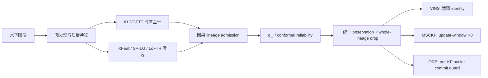

# AQUA-FE / Round 00 / project-progress-review / 2026-07-30

> 本文是截至 2026-07-30 的项目级全量进展审计。`r00` 表示跨实验线的临时综合轮次，不代表已有语义化 Round 0；待论文实验编号冻结后应统一重命名。当前仓库未绑定 Obsidian，因此未执行 Obsidian write-back。

> 2026-07-31 后续进展见 [AQUA-FE Round 01 addendum](2026-07-31--aqua-fe--r01--project-progress-addendum.md)，其中记录 AFRL Gennie post-init ORB 五臂四轮结果；本文其余内容保留为 7 月 30 日时间点快照。

## 1. 执行摘要（Executive Summary）

### 1.1 一句话结论

**AQUA-FE 已经越过“learned 特征在水下 VIO/SLAM 中是否有用”的可行性阶段。答案已经是肯定的。真正被实验支持的方法不是用 learned matcher 替换 KLT，而是把 learned 特征限制为经过因果确认的稀疏 lineage，再按照 VINS、MSCKF 和 ORB 各自的状态语义约束其后端影响。**

项目当前最有价值、也最适合作为论文主线的贡献是：

> **Causal learned-lineage admission + backend-aware bounded influence。**
>
> XFeat/LoFTR/SP-LG 提供候选或出生 seed，KLT 维持持续身份；lineage 经过存活、空间新颖性、运动一致性与几何检查后才被接纳；消融删除完整 lineage；进入后端后，再依据滑窗、更新窗或关键帧地图提交语义限制其影响。

这条主线已经在三个后端形成不同强度但相互解释的证据：

| 后端 | 当前结论 | 证据强度 | 还缺什么 |
| --- | --- | --- | --- |
| VINS-Fusion | 冻结 20 簇评测中 learned-active 为 `10/11` APE 胜；final-online 在 A10/A09 获得五轮双指标强正例 | 强 | 新数据长段盲测、降低窗口筛选偏差 |
| MSCKF-DVIO | 未压缩 lineage 在 A10 失败；K8 update-window 适配后 A07/A10 均 `5/5` 双胜 | 受控强证据 | 非 AQUALOC 外推、自主初始化 |
| ORB-SLAM3 | A10 上 v23 阻止已知 assisted outlier 持久提交；NTNU 正常纹理 exact no-harm；NTNU 低纹理 formal 是零 action 负结果 | 单窗因果证明 + 跨数据安全/边界证据 | post-init 第二域机制正例、A09 完整窗 |

### 1.2 项目已经完成了什么

1. 建成了完整的水下混合前端研究系统，而不是单一脚本原型：KLT/GFTT 主干、ORB 恢复、XFeat/XFeat-star、SuperPoint+LightGlue、LoFTR、质量估计、混合调度、VINS bag 导出、因果 sidecar、后端三路评测与大量审计工具均已存在。
2. 建立了可审计的 learned 贡献定义：`full`、完整 learned-lineage `drop`、独立 KLT 三路，而不是只比较两个不同前端配置。
3. 用强控制推翻了一批早期伪正例，明确区分 backbone/export 合同收益、learned observation 真贡献和 solver/初始化偶然性。
4. 在 VINS 上形成冻结统计证据，在 MSCKF 上发现并修复更新窗过度观测问题，在 ORB 上定位并修复持久地图提交问题。
5. 建立了 `q_i` 可靠性、Mondrian conformal coverage 和后端异方差权重接口，但也证明 raw `q_i` 不能直接当作单调精度旋钮。
6. 保存了真实反例、失败版本、字节级复现和源代码快照。项目的科学可信度来自这些反证和修正，而不只来自最好看的数字。
7. 完成 ORB 的第一轮 NTNU 外推：正常纹理 `s50,d20` 在 12 arms 上 reconstructed/online 全字节一致；低纹理 `s30,d10` 的 8 个 pre-init observations 未形成 MapPoint，四指标 no-harm `0/4`，明确暴露了 guard 上游的状态可达性瓶颈。

### 1.3 当前总判断

**研究系统成熟度高，证据成熟度中高，跨域外部效度仍不足，论文成熟度明显落后于实验成熟度。**

当前不应该继续无限寻找新窗口、调新阈值或扩展新 matcher。最正确的项目动作是：

- 冻结 final-online causal lineage、MSCKF K8/gap60 和 ORB v23；
- 保留 NTNU 正常纹理 exact no-harm 和低纹理 formal 负结果；下一第二域候选必须先满足 post-init MapPoint reachability，不在 `s30,d10` 上调参；
- 生成统一跨后端主表与主图；
- 立即重写论文提纲并进入正文写作。

换言之，项目现在缺的不是“再证明一次能够工作”，而是**把已经发现的方法冻结成一个统一论点，并完成外部验证与论文封装**。

### 1.4 当前成熟度矩阵

| 工作面 | 当前阶段 | 项目判断 |
| --- | --- | --- |
| 前端基础设施 | 成熟 | 多 matcher、调度、质量、导出、消融、评测和回归链条完整 |
| VINS 冻结证据 | 强 | 已有窗口簇统计、三路对照、反例、置信区间和回归保护 |
| final-online causal lineage | 成熟研究原型 | 在线因果合同和强正例成立，尚未实时化 |
| `q_i` / C1 conformal | 可写次贡献 | 可靠性和 95% coverage 成立，不能写成主增益来源 |
| MSCKF 可迁移性 | 受控证明完成 | K8 修复两个 AQUALOC 窗口，跨域和自主初始化未完成 |
| ORB 可迁移性 | 因果正例 + 跨域边界证据 | v23 A10 证据强；NTNU normal exact no-harm 已完成；NTNU low formal 零 action 且 online APE 失败，尚无第二域机制正例 |
| 跨数据外部效度 | 部分完成 | VINS 有多域矩阵和弱正例；ORB 有 NTNU 安全/负结果边界；MSCKF 仍集中于 AQUALOC |
| 实时部署 | 未完成 | Python sidecar 明显慢于实时，ORB 确定性合同也不是部署模式 |
| 论文资产 | 分析成熟、正文滞后 | 统计包和图已有，旧提纲过时，尚无完整 manuscript |
| C2/C4 扩展 | 未开始实现 | 不应阻塞当前主线收尾 |

## 2. 实验身份与决策背景（Experiment Identity and Decision Context）

### 2.1 项目目标的演化

项目最初的问题可以概括为：在低纹理、散射、近壁和平面主导的水下图像中，是否能通过 learned feature/matcher 改善传统 KLT 前端，并最终改善 VINS-Fusion 轨迹。

经过 5 月至 7 月的连续实验，问题已经被改写为三个更精确的问题：

1. learned observation 是否提供 KLT 尚未覆盖、且具有真实几何价值的新约束？
2. 如何以严格因果方式把这一约束变成可持续、可消融的 feature lineage？
3. 同一 lineage 进入不同状态估计后端时，如何避免其被重复、长期或持久地放大？

第三个问题最终成为项目最有原创性的部分。VINS、MSCKF、ORB 的迁移失败并不共享同一个简单阈值原因，它们分别暴露了不同的 observation contract：

- VINS：有限滑窗中的 feature identity 和残差生命周期；
- MSCKF：同一 lineage 在单次 update window 中的观测压缩；
- ORB：优化器外点在 KeyFrame/MapPoint 持久化前的提交控制。

### 2.2 本报告要作出的项目决策

本报告不是日志汇编，而是为以下决策提供依据：

- 是否继续把主要资源投入“寻找正例”？答案：**不再作为主任务**。
- 是否已有足够材料形成论文方法主线？答案：**有，而且应立即写**。
- 哪些模块应进入主论文？答案：**因果 learned lineage、完整 lineage 消融、后端感知的有界影响；C1 conformal 可作为次贡献**。
- 哪些模块应暂缓？答案：**C2 连续退化后验和 C4 CoTracker/TAP，在主线冻结前不应扩展**。
- 哪些证据还必须补齐？答案：**ORB 具备 post-init MapPoint 的第二域机制正例与 A09、MSCKF 非重叠跨域外推、统一跨后端图表与盲测**。ORB 正常纹理 no-harm 已在 NTNU 闭合，不再列为未完成项。

### 2.3 证据等级

本文使用四级证据口径：

| 等级 | 定义 | 当前代表结果 |
| --- | --- | --- |
| A：冻结/可主张 | 协议冻结、控制充分、统计单位明确、结果可复现 | VINS 20 簇三路评测；final-online 五轮强正例 |
| B：受控因果/安全证明 | 单窗或有限数据，但机制、null path、重复和事件链充分 | MSCKF K8 A07/A10；ORB v23 A10；NTNU `s50,d20` exact no-harm |
| C：机制/边界证据 | 能支持机制或失败边界判断，尚不足以外推 | A06 LoFTR sparse contribution；`q_i` reliability；NTNU `s30,d10` formal 负结果与高剂量 purge 诊断 |
| D：历史/已降级 | 被更强控制推翻，或混有不同 backbone、初始化、线程/地图分支效应 | 早期 AFRL/NTNU 表面正例；mirror-inject 的强 LoFTR 归因 |

报告中的强结论只建立在 A/B 级证据之上。C 级结果用于解释机制，D 级结果保留为研究演化和反证记录。

### 2.4 项目时间线

| 时间 | 主要工作 | 形成的认识 |
| --- | --- | --- |
| 5 月上旬 | KLT/ORB/XFeat/SP-LG/LoFTR 基线；质量调度；`q_i/sigma_i`；前端指标体系 | learned matcher 不能直接替代稳定的长期 KLT identity |
| 5 月 15 日前后 | 三层安全结构：保护 KLT、learned sidecar、几何/coverage gate | A09 表明直接注入会显著伤害后端 |
| 5 月 18-22 日 | `proposed_safe` mirror KLT、`contribution_sparse`、A06 LoFTR、H07 no-harm | 首次分离“系统安全表现”和“learned 真贡献” |
| 5 月 24-28 日 | dense-KLT、same-budget、same-backbone、`source_code/is_learned`、source-drop | 多个旧正例被推翻；强控制成为硬要求 |
| 6 月 12-15 日 | exact-source reliability、Mondrian conformal、tempered quality、风险门控工具 | `q_i` 是可靠性接口，不是单调增益来源 |
| 6 月下旬至 7 月 14 日 | XFeat seed-chain、init-safe、microburst、visible/motion/count/low-grid 仲裁 | pairwise learned 注入退出主线，persistent lineage 成为主线 |
| 7 月 14 日 | 冻结 20 簇、60 arm 的 full/drop/KLT 统一评测 | VINS 主体证据形成，真实反例被保留 |
| 7 月 15-17 日 | 146 个 fresh probes；空间新颖性和因果 lineage | 盲扫窗口收益很低；门控饱和、晚爆发和过早注入是关键失败模式 |
| 7 月 18-22 日 | 365 个跨域 probes；final-online XFeat seed-to-KLT | A10/A09 强正例，NTNU/UVVID 弱正例，反例边界更清晰 |
| 7 月 26-27 日 | 迁移 MSCKF；未压缩 A10 失败；K8 修复 | 同一 lineage 必须适应 update-window 语义 |
| 7 月 29-30 日 | ORB v1-v23 迁移、确定性审计和提交边界诊断 | pre-KF assisted-outlier commit guard 得到稳定 A10 正例 |
| 7 月 30 日晚 | v23 冻结外推到 NTNU fjord_4 低/正常纹理窗 | 正常纹理 12 arms exact no-harm；低纹理 lineage 未进入持久地图，跨域正例不成立，瓶颈上移到 post-init MapPoint reachability |

## 3. 系统架构、实验设置与评测协议（Setup and Evaluation Protocol）

### 3.1 当前技术架构

这张图表达的是当前统一研究结论，不表示所有分支已经被打包成一个单一实时进程。当前实现仍由若干成熟实验 profile、ROS 节点、bag 转换器和后端专用补丁组成，**研究逻辑已统一，运行时产品尚未统一**。

### 3.2 前端组成

当前代码支持：

- KLT/GFTT temporal backbone；
- relaxed LK 和 ORB recovery；
- XFeat、XFeat-star、SuperPoint+LightGlue、LoFTR adapters；
- `HybridScheduler` 的 normal、degraded texture、planar/near-wall、severe low-texture 模式；
- observation 级 `q_i` 与 `sigma_i = sigma_base / sqrt(q_i + eps)`；
- quality-aware measurement selection；
- VINS external-feature bag export；
- online causal XFeat seed-to-KLT lineage sidecar；
- source/lineage 级消融和后端三路 runner。

项目代码规模截至本次审计为：

- `uw_frontend`：56 个 Python 模块，约 27,223 行；
- `scripts`：145 个 Python/shell 脚本，约 43,643 行；
- Python 测试：14 个测试模块，约 2,814 行；
- `logs`：约 67,162 个可索引路径，实际位于 `/mnt/data/AQUA-FE_WS/logs`；
- 源码快照：`aquafe_source_backup_20260623_023723.tar.gz` 与 `msckf_dvio_lineage_source_20260727.tar.gz`。

代码规模不是科学结论，但它说明项目已具备完整的实验、审计和复现基础，而非一次性 demo。

### 3.3 三类 learned 方法的最终定位

| 方法 | 当前角色 | 可以主张什么 | 不能主张什么 |
| --- | --- | --- | --- |
| XFeat | 当前主线 seed proposer；经确认后由 KLT 维持 lineage | 支持 frozen、final-online、MSCKF 和 ORB 跨后端主线 | 不能写成 XFeat 单独替代 KLT |
| LoFTR | 极端低纹理、近壁平面条件下的稀疏补约束 | A06 sparse profile 有明确机制贡献 | 不能把 mirror-inject 全部增益归因于 10 条 LoFTR |
| SP-LG | 成熟稀疏 sidecar 和前端连续性模块 | 前端连续性有正向统计 | 当前没有 strict exact-drop 下的强后端主正例 |

Standalone matcher 对照进一步说明 KLT lineage 为什么不可替代：XFeat/SP-LG/LoFTR 的加权 track age 分别只有 `1.00/4.59/1.54`，dropout ratio 为 `0.726/0.243/0.665`，运行时间约 `657/4593/5179 ms`。learned 模块适合提出稀疏新约束，不适合作为长期 identity backbone。

### 3.4 final-online 因果准入合同

当前 VINS 主线不是预扫描未来 ID，而是在线、因果地执行：

- XFeat 只产生 seed proposal；
- 使用独立 LK/KLT 传播；
- 要求 10 帧存活确认；
- 相对既有 KLT 具有至少 40 px 空间新颖性；
- learned motion / KLT motion 比率位于 `[0.6, 1.5]`；
- homography residual 不超过 `0.75 px`；
- 单次最多接纳一条 lineage；
- 队列有界，不能依赖未来帧预知。

这一合同把“learned 点”变成“经过存活和几何验证、KLT 尚未覆盖的持续观测”。它是当前方法区别于简单 feature injection 的核心。

### 3.5 统一评测口径

VINS 冻结评测采用：

- `full`：保留 accepted learned lineage；
- `drop`：从同一 full bag 删除整个 learned lineage，包括后续 KLT 传播；
- `KLT`：独立 fresh KLT baseline；
- 主指标：SE(3) 对齐 APE RMSE；
- 次指标：1 s 平移 RPE RMSE；
- 时间匹配上限：0.6 s；
- 统计单位：manifest 中不重叠的时间窗口簇；
- no-harm：相对 KLT 的 APE 退化不超过 5%；
- hard failure 与 solver-risk 分开统计。

MSCKF 和 ORB 在此基础上增加后端特定合同：

- MSCKF：每条 learned lineage 在当前 update window 最多 8 个观测，保留首尾并均匀选择中间观测；不是 bag 层的 stride/drop。
- ORB：同时评估关机后 reconstructed trajectory 和在线输出 trajectory；四指标都纳入验收；候选只在 KeyFrame 创建前清除已被 PoseOptimization 判为外点的 assisted slot。

### 3.6 可复现性和环境边界

- 本工作区本身不是一个独立 Git repository；`git rev-parse --show-toplevel` 指向 `/`，其根历史与本项目无关。因此当前 provenance 依赖 source backup、文件 hash、run manifest、配置和原始结果目录。
- VINS 正式实验应使用 `/home/ma/SLAM/VINS-Fusion-origin`，不得改动 `/home/ma/SLAM/VINS-Fusion_3-15-WS`。
- ORB v23 隔离源码位于 `/home/ma/SLAM/orb_slam3_lineage_ws/src/ORB_SLAM3-lineage`。
- Python 全量测试本次运行结果为 `68/68` 通过；MSCKF 报告记录 15 个 C++ 测试通过；ORB runner `19/19`、evaluator `10/10`，库和 `mono_euroc_old` 编译成功。
- 冻结回归中 7/7 核心前端文件 hash 一致，33/33 protected full/drop/KLT bags hash 一致，无缺失和 mismatch。

## 4. 主要发现（Main Findings）

### 4.1 前端本身已证明能够改善低纹理连续性

A06 `2210-2460` 的稳定前端结果为：

| 指标 | KLT / baseline | hybrid / proposed | 变化 |
| --- | ---: | ---: | ---: |
| dropout | 24.35 | 8.16 | `-66.5%` |
| median track age | 22 | 45 | 约 `2.05x` |
| long-track ratio | 0.794 | 0.904 | `+0.110` |
| epipolar median | 0.1538 | 0.1475 | 改善 |

这组结果证明了混合前端能改善连续性和几何一致性，但它不能单独证明 learned observation 对后端轨迹的因果贡献。后者必须依靠完整 lineage drop 和同 backbone 控制。

### 4.2 A06 LoFTR 的真实贡献和被降级的强归因

稀疏 contribution profile 中：

| 配置 | APE / RPE |
| --- | ---: |
| sparse KLT | `0.265652 / 0.113263` |
| SP-LG without LoFTR | `0.255863 / 0.108435` |
| SP-LG + LoFTR | `0.118616 / 0.062520` |

该结果包含 10 个确认的 LoFTR observations，位于两个 burst，能够作为极端低纹理 profile-level learned contribution 证据。

但 May22 mirror-inject 的强结果必须重新解释：

- KLT baseline：`0.268486 / 0.113326`；
- mirror-inject：`0.058071 / 0.048803`；
- 精确删除相同 10 个 LoFTR observations：`0.058073 / 0.048804`。

因此，mirror-inject 的巨大改善几乎全部来自 full-KLT mirror/export policy，而不是这 10 条 LoFTR。**LoFTR 的贡献应引用 sparse/degraded profile，不能引用 mirror-inject 的全部增益。**

H07 `1660-1720` 提供了对应 no-harm：KLT 为 `0.050207 / 0.113417`，proposed 为 `0.050207 / 0.113416`，且 learned/LoFTR 实际导出为零。

### 4.3 冻结 20 簇 VINS 证据已经达到论文级

2026-07-14 的统一矩阵包含 20 个 fresh 窗口簇、60 个主要 arms。结果为：

| 队列 | APE 胜 | 双指标胜 | no-harm | hard failure | full solver-risk |
| --- | ---: | ---: | ---: | ---: | ---: |
| 预选主队列 | `9/9` | `9/9` | `9/9` | `0/9` | `4/9` |
| 全部 fresh | `18/20` | `16/20` | `19/20` | `0/20` | `10/20` |
| learned-active fresh | `10/11` | `9/11` | `10/11` | `0/11` | `6/11` |
| learned-inactive fresh | `8/9` | `7/9` | `9/9` | `0/9` | `4/9` |

learned-active 相对 KLT 的 APE 改善中位数为 `25.3%`；相对完整 lineage drop 的改善中位数为 `40.6%`。所有 11 个 learned-active 窗口中，full APE 都优于 whole-lineage drop。

这一结果足以支持：

> 在冻结的低纹理水下窗口矩阵中，经过准入的 learned-seeded KLT lineage 通常不弱于 KLT，并经常降低 VINS APE；当 lineage 被激活时，完整删除它会系统性损失轨迹精度。

它不支持“所有 learned 点都有效”，因为唯一超过 5% 的 active 反例 A09 `5000-5400` 中，full APE `1.360408`，KLT `1.082993`，退化 `25.6%`。这个反例必须保留在主文或补充材料中。

### 4.4 final-online 把冻结 profile 推进到严格因果实现

冻结矩阵解决了证据规模问题，final-online 则解决了未来信息和离线 selection 问题。当前核心结果为：

| 数据/窗口 | full APE/RPE | drop APE/RPE | KLT APE/RPE | 五轮判定 |
| --- | ---: | ---: | ---: | --- |
| AQUALOC A10 `2400-2800` | `0.639080/0.180777` | `1.042609/0.264110` | 与 drop 相同 | `5/5` 双胜，强正例 |
| AQUALOC A09 `4000-4400` | `0.867753/0.220984` | `1.062588/0.262938` | `1.062843/0.263005` | `5/5` 双胜，强正例 |
| NTNU fjord4 `s30,d10` | `0.010754/0.013997` | `0.010763/0.014016` | 与 drop 相同 | 稳定弱正例 |
| UVVID Orientkaj `s120,d20` | `0.606523/0.279930` | `0.606561/0.280023` | `0.606556/0.280024` | 稳定弱正例 |

A08 `6800-7200` 的因果选择也提供了直接机制证据：KLT `0.163098/0.225271`，causal full `0.157138/0.224854`，`5/5` 双胜；该 lineage 的空间新颖性为 `171.703 px`，motion ratio 为 `1.046`。与之相对，A03 候选的 motion ratio 为 `1.697`，被上限 1.5 拒绝，并实现 exact KLT fallback。

这说明真正有效的不是“检测到更多点”，而是**检测到 KLT 没有覆盖、运动与场景一致、并能存活足够久的少量新 lineage**。

### 4.5 广泛盲扫的结果反而强化了稀疏准入结论

项目曾执行 146 个 fresh frozen probes，以及约 365 个跨域 probes、507 条成熟 lineages 的搜索。结果没有发现大量新的强正例，反而发现：

- 很多 candidate 已被 KLT 空间覆盖；
- 一部分在几何或 motion gate 上失败；
- 过早注入会破坏初始化；
- 过晚 burst 往往来不及产生有效后端约束；
- 大 dose 的 learned observation 容易引起 solver 或地图分支风险。

这不是项目失败，而是对方法形态的重要收敛：**learned sidecar 的价值来自稀疏、选择性和后端约束，而不是覆盖率最大化。** 继续盲扫窗口的边际收益已经很低。

### 4.6 `q_i` 可靠性成立，但 raw quality 不是轨迹优化旋钮

`q_i` 可靠性审计覆盖 77,206 个 observations、5,662 条 tracks。从最低到最高 q decile：

- survival：`0.896 -> 0.946`；
- F-inlier：`0.900 -> 0.997`；
- epipolar median：`0.271 -> 0.089`；
- sigma：`3.690 -> 1.185`。

这证明 `q_i` 与观测可靠性、几何一致性和异方差尺度具有明确关系。VINS 也已经真实消费 `quality`，通过 `sqrt(q_i)` 缩放残差。

但后端结果说明 raw q 会过度改变优化：同一 H07 feature stream 中，raw q 为 `0.588238/0.239848`，const-q 为 `0.102605/0.068534`，conformal95 tempered blend0.85 五轮中位为 `0.085963/0.065213`。A06 仅有 10 个干净 LoFTR 点时，q=`0.6/0.8/1.0` 只使结果在约 `0.058071-0.058206` 范围变化。

最终结论是：

> `q_i` 是可靠性校准、异方差建模和准入的接口，不是 learned 正例的主因，也不保证 q 越大或越小轨迹越好。

### 4.7 C1 Mondrian conformal 已可作为论文次贡献

95% nominal coverage 下的 leave-one-domain held-out survival coverage 为：

| 数据域 | 实际 coverage |
| --- | ---: |
| AFRL-FL | `92.79%` |
| AFRL-FR | `95.45%` |
| A06 | `98.73%` |
| H06 | `97.30%` |
| H07 | `94.69%` |

这组结果足以支持 95% 档位的 paper-ready reliability claim。AFRL-FR exact-source held-out 的 Brier/ECE 从旧模型 `0.2029/0.2014` 改善到 `0.1751/0.1222`。

但 80%/90% 档位、真实逐点 reprojection residual-ratio coverage 尚未完成。C1 应作为“可靠性接口”次贡献，不应压过 causal lineage 和 backend contract 主线。

### 4.8 C3 风险门控有基础设施和机制证据，但尚未闭合

当前已有 tau scan 和 conformal risk export gate。关键观察为：

- `tau=2` 能阻断 H07 sidecar 并保持 no-harm；
- `tau=0` 会伤害 H07；
- A06 收益取决于早期 LoFTR timing，不是相同数量在任意时刻都有效。

但正式 CRC-selected tau、tau x budget 的完整 VINS 矩阵尚未完成。因此 C3 可写成安全分析或附录，不应写成已经完成的风险控制理论贡献。

### 4.9 MSCKF 迁移证明了 update-window observation contract

直接把 VINS 正例迁移到 MSCKF 时，结果出现明确分化：

| 窗口 | uncompressed full | drop | KLT | 判定 |
| --- | ---: | ---: | ---: | --- |
| A07 | `0.580671/0.161240` | `0.600891/0.166355` | `0.620333/0.169719` | 正例 |
| A10 | `0.693840/0.164451` | `0.598673/0.153943` | 与 drop 相同 | 真反例，`0/5` |

MSCKF 对同一 lineage 在当前 update window 中一次性形成多条相关约束。未压缩的 A10 把 VINS 正例放大成负面更新。加入 K8 后：

| 窗口 | full-K8 APE/RPE | drop APE/RPE | KLT APE/RPE | 判定 |
| --- | ---: | ---: | ---: | --- |
| A07 | `0.584514/0.162110` | `0.600891/0.166355` | `0.620333/0.169719` | 对两控制均 `5/5` 双胜 |
| A10 | `0.596456/0.153599` | `0.598673/0.153943` | 与 drop 相同 | 对两控制均 `5/5` 双胜 |

30/30 arms 全部初始化，无 solver failure；六个 role/window 轨迹文件各自跨五轮逐字节一致。

K8 的科学含义不是“8 是神奇阈值”，而是：**同一因果 lineage 的有用性不能自动授权后端无限重复消费它。** MSCKF 需要 per-update bounded influence。K7/K8 可行、K9 失败，因此当前正确动作是冻结 K8 并外推，而不是继续在 A07/A10 上调参。

限制同样明确：目前仅有 AQUALOC，初始化使用共同 `gt_calibrated` 状态，尚不能宣称自主初始化或跨数据 MSCKF 完成。

### 4.10 ORB 失败原因已经从“猜测”推进到提交边界因果链

VINS/MSCKF 中，一个 association 是有限生命周期残差；外点被拒绝后，track 会被边缘化或结束。ORB-SLAM3 则可能把同一 association 变成持久地图状态。

失败的关键顺序为：

1. learned-assisted association 进入 pose optimization；
2. `PoseOptimization()` 已把它标为 outlier；
3. 单目 `TrackLocalMap()` 仍保留当前帧 MapPoint association；
4. `CreateNewKeyFrame()` 在通用 outlier cleanup 之前执行；
5. 该外点进入 KeyFrame observation、MapPoint、covisibility graph 和后续 BA。

这解释了为什么后置 MapPoint quarantine、terminal lineage quarantine 和 two-strike 都无效：它们只阻止未来消费，却没有阻止第一次错误 observation 被提交。

### 4.11 ORB v1-v23 的失败链不是冗余试错，而是机制排除

| 版本阶段 | 核心机制 | 结果与结论 |
| --- | --- | --- |
| 历史 detector seed | XFeat pixel 追加为 octave-0 ORB keypoint，ORB 重算 descriptor | A09 旧 binary 曾有正向，但 current counterbalanced 未复现；只证明 seed 会改变地图分支 |
| v1-v3 | lineage metadata、bridge、MapPoint/KeyFrame propagation | 证明 lineage 真实进入后端，但 A09/A10 不稳定支配 exact-drop |
| v4 | MapPoint culling grace | grace-16 明显恶化；方向终止 |
| v5-v9 | 单 CPU、barrier、no-ASLR、deterministic background gate | 短窗可 `3/3` 正向，但 401 帧排序反转；短窗不等于持久地图收益 |
| v10 | 同时评估 online 与 reconstructed | 揭示 BA 回写会改变短窗结论，建立四指标验收 |
| v11 | lifetime budget=8，类比 MSCKF K8 | 失败；ORB lifetime cap 不等价于 update-window K8 |
| v12 | native-birth-only | 短窗无 learned action，长窗形成 assistance 后显著恶化 |
| v13 | assisted outlier 后 MapPoint quarantine | 短窗局部有效，长窗四指标全败；发生太晚 |
| v14-v21 | terminal quarantine、shadow、等运行、first/two-strike | 逐步排除运行时扰动并锁定“外点已知但仍被提交”的事件链 |
| v22 | pre-KF + native-first | native-first 清空 learned assistance，不能验证 fallback；回退 |
| v23 | lineage-first + late-enforce + pre-KF exact outlier purge | A10 401 帧稳定正例，当前冻结候选 |

### 4.12 ORB v23 已经构成单窗强因果证明

v23 在 `NeedNewKeyFrame()` 已经作出关键帧决策后、`CreateNewKeyFrame()` 之前执行。它只清除精确绑定到 assisted MapPoint 且 `mvbOutlier=true` 的 frame slot：

- 不改当前 pose；
- 不改是否建立关键帧；
- 不改 MapPoint/Atlas 状态；
- 不启用 MP quarantine 或 terminal quarantine；
- 保留其他有效 learned-assisted matches。

零动作 probe 中：41 帧输入、10 个 seed observations，full/unbounded 各执行 20 次扫描，assisted match/outlier/purge 全为 0；reconstructed、online 和 `seed_events.csv` 逐字节一致。这排除了“只要多跑了一段代码就改变 ORB 分支”的解释。

401 帧 A10 `2400-2800` 正式结果为：

| 角色 | reconstructed APE/RPE | online APE/RPE |
| --- | ---: | ---: |
| native ORB | `0.014089/0.017840` | `0.029865/0.034533` |
| bridge-off | `0.016726/0.019167` | `0.031762/0.032362` |
| unbounded r1/r3/r4 | `0.015293/0.021555` | `0.035038/0.028440` |
| unbounded alternate r2 | `0.010527/0.014161` | `0.025364/0.025078` |
| v23 candidate r1-r4 | `0.011993/0.016178` | `0.023529/0.019948` |

v23 candidate 相对 native ORB：

- reconstructed APE/RPE 改善 `14.877%/9.316%`；
- online APE/RPE 改善 `21.215%/42.235%`。

相对四轮 unbounded 均值：

- reconstructed APE/RPE 改善 `14.952%/17.905%`；
- online APE/RPE 改善 `27.868%/27.723%`。

四轮 candidate 的 reconstructed trajectory、online trajectory 和事件流逐字节一致；r4 交换 candidate/control 执行顺序后仍一致。candidate 消费了 52 次 assisted matches，观察到 15 个 assisted optimizer outliers，在 pre-KF 边界发现并清除了 `13/13` 个，quarantine 计数为零。因此这不是“关闭 learned”得到的收益。

因果锚点同样清晰：r1/r3/r4 的 shadow 和 candidate 到 event 59 前完全相同；token11/frame43/MP5896 被判 assisted outlier 后，shadow 将其提交到 KF24，candidate 不提交；在线轨迹前 26 行逐字节一致，从下一帧开始分叉。

r2 的 unbounded 在 candidate 第一次 action 前已进入另一地图分支，因此 candidate 对 unbounded 的逐轮四指标判定是 `3/4`，不能写成 `4/4` 普遍支配。但 candidate 对 native ORB 和 bridge-off 是稳定四指标正例。**当前最强可写结论是：ORB 迁移失败的主因是持久地图提交时序，v23 在该边界阻断已知外点后，保留 learned assistance 并得到可重复 A10 正例。**

### 4.13 NTNU 外推闭合了 normal no-harm，但没有得到第二域 v23 正例

本轮把 A10 的 v23 binary、参数与确定性运行合同原样迁移到独立 NTNU `fjord_4`，没有修改源码、阈值或 lineage 剂量。

正常纹理 `s50,d20` 是严格 no-harm 结果：

- 199/200 前端帧为 `healthy`，grid coverage 中位数 `0.9444`，selector 注入 0；
- 四轮 x `orb_only/drop/full` 共 12 arms；r4 交换 `full/drop` 顺序；
- 每臂 `390/399` poses，coverage `0.9774436090`，零 reset/relocalization/overflow；
- reconstructed 全部为 `0.316160/0.218529`，online 全部为 `0.318803/0.218009`；
- reconstructed 与 online 轨迹分别在全部 roles/repeats 中逐字节一致；
- v23 candidate 每轮执行 240 次 pre-KF scan，所有 learned/action counters 为 0。

因此允许写：**在这个不重叠的正常纹理 NTNU 窗口上，冻结 causal fallback 和 v23 runtime path 精确保持 native ORB 输出。**不能扩写成所有正常场景的普遍 no-harm 定理。

低纹理 final-online `s30,d10` 则是必须保留的 formal 负结果：

| 角色/分支 | reconstructed APE/RPE | online APE/RPE |
| --- | ---: | ---: |
| native / exact-drop | `0.017459/0.239246` | `0.029706/0.232416` |
| v23 r1-r3 | `0.017143/0.238865` | `0.033311/0.234293` |
| v23 role-swap r4 | `0.016554/0.239783` | `0.033535/0.233595` |

正式 selector 只导出 1 条 lineage、8 个 observations。所有 seeded roles 都接受 `8/8`，但 `0` MapPoint、`0` assisted match、`0` optimizer outlier、`0` purge。四轮 candidate 的 reconstructed APE 平均改善 `2.653%`，但 online APE 平均恶化 `12.324%`，四指标 5% no-harm 为 `0/4`。由于 guard 从未 action，这些地图分支差异不能归因于 v23。

历史 `n6,d20` 多-lineage 资产只用于诊断：unbounded 有 19 assisted matches、1 outlier、`1/0` pre-KF；candidate 有 15 matches、3 outliers、`1/1` pre-KF。candidate reconstructed 为 `0.023451/0.238427`，online 为 `0.033644/0.234253`，并未支配 native。事件流从 index 500 起已不同，而第一个 candidate assisted-outlier event 到 index 531 才出现，因此不是 same-prefix 因果对照。

这轮最重要的机制更新是：**跨数据迁移瓶颈已经上移到 guard 之前。seed 被 ORB extractor 接受不等于 lineage 形成持久 MapPoint；只有 post-init lineage 进入可持续地图状态后，pre-KF commit guard 才有作用对象。** 当前动作应是换满足该可达性条件的冻结候选，不是在 NTNU `s30,d10` 上增加 dose 或调 v23。

## 5. 统计验证（Statistical Validation）

### 5.1 VINS 冻结矩阵

learned-active fresh 的 full vs KLT：

- APE 胜率：`10/11 = 90.9%`；
- 95% 区间：`62.3%-98.4%`；
- APE 相对改善中位数：`25.3%`；
- 簇 bootstrap 95% CI：`3.8%-61.0%`；
- exact sign test：`p=0.011719`；
- rank-biserial effect：`0.758`。

learned-active fresh 的 full vs whole-lineage drop：

- APE 胜率：`11/11`；
- APE 相对改善中位数：`40.6%`；
- bootstrap 95% CI：`14.5%-93.1%`；
- Holm-adjusted exact sign-test `p=0.001953`；
- effect size：`1.0`。

这些统计支持“accepted lineage 在当前冻结矩阵中具有一致贡献”，但独立统计单位仍是窗口簇，不是每一帧或每一个 feature observation。不能把大量帧当作独立样本扩大显著性。

### 5.2 重复性与确定性

- final-online A10/A09 的主要强正例均完成五轮重复并保持双指标胜；
- MSCKF K8 的 A07/A10 均为 `5/5` 双指标胜，轨迹文件跨重复字节一致；
- ORB v23 candidate 四轮字节一致，并包含 role-order swap；
- ORB null probe 在没有 assisted action 时三类输出字节一致；
- NTNU normal no-harm 的 12 arms 在 reconstructed/online 两类轨迹上分别跨 role、跨轮全部字节一致；
- NTNU low formal 的 native/exact-drop 跨四轮字节一致，candidate r1-r3 一致，r4 role swap 暴露另一个零-action 自然地图分支；
- 冻结前端和 protected bags 均通过 hash 回归。

这使当前结论远强于单轮最优结果。特别是 ORB，项目已经把原本由线程、BA 回写和地图分支主导的噪声问题，转化为可审计的 deterministic experimental contract。

### 5.3 统计边界

仍需明确以下限制：

- 20 簇矩阵包含历史筛选影响，不能等同于完全盲抽样总体；
- final-online 强增益主要来自 AQUALOC，NTNU/UVVID 为小幅正向；
- MSCKF 与 ORB 当前样本量不足以做跨数据总体统计；
- ORB r2 展示了 unbounded 地图自然分支可能偶然优于稳定 candidate 的 reconstructed 指标；
- NTNU low/normal 各只有一个固定窗口；四轮是运行时重复而非四个独立数据样本，不能据此执行人口层面的 t/Wilcoxon 检验；
- NTNU low final-online 的 `0/4` no-harm 是该冻结 lineage 的负结果，不等于 v23 在整个 NTNU 数据集失效；
- solver-risk 在 frozen fresh 中为 full `10/20`，因此不能声称系统普遍提高求解器稳定性；
- NTNU 部分参考轨迹来自 ReAqROVIO baseline，不是完全独立真值。

这些边界不削弱项目主线，但决定了主张层级：VINS 可作矩阵级统计主张；MSCKF/ORB 当前应作机制与受控迁移主张。

## 6. 图表逐项解释（Figure-by-Figure Interpretation）

### Figure 1：逐窗口 APE ratio

文件：`frozen_frontend_eval_20260714/analysis-output/figures/figure-01-casewise-ape-ratio.pdf`

- 为什么展示：这是 frozen full 相对 KLT 的最直接逐案例视图。
- 应观察什么：大多数 learned-active 窗口位于 ratio 1 以下，说明 APE 改善；A09 `5000-5400` 明确越过 1.05 no-harm 边界。
- 支持什么：增益不是由单个极端案例独占，且反例没有被隐藏。
- 决策意义：主文应保留逐案例分布，不应只给均值或最佳窗口。

### Figure 2：outcome 与 risk rate

文件：`frozen_frontend_eval_20260714/analysis-output/figures/figure-02-outcome-and-risk-rates.pdf`

- 为什么展示：把 APE 胜率、双指标胜率、no-harm、hard failure 和 solver-risk 放在一起。
- 应观察什么：轨迹 outcome 很强、hard failure 为零，但 solver-risk 比例仍高。
- 支持什么：系统有明显精度价值，且没有新增硬失败；但数值稳定性尚不能作为强卖点。
- 决策意义：论文应把 solver-risk 当作限制和未来工程目标，不应把“无 hard failure”扩写成“求解完全稳定”。

### Figure 3：learned-active 的 KLT/drop 双控制改善

文件：`frozen_frontend_eval_20260714/analysis-output/figures/figure-03-learned-active-improvements.pdf`

- 为什么展示：区分“相对 KLT 的系统结果”和“相对 whole-lineage drop 的直接贡献”。
- 应观察什么：11/11 窗口相对 drop 改善，但有一个窗口相对 KLT 退化。
- 支持什么：accepted lineage 在 full 系统中确实贡献了轨迹信息，但 learned 系统并非对强 KLT 普遍支配。
- 决策意义：主张应围绕“可验证的稀疏贡献和 no-harm 合同”，而不是 detector leaderboard。

### Figure 4：NTNU 低纹理四指标相对变化

文件：`orb_v23_crossdataset_ntnu_20260730/analysis-output/figures/figure-01-low-texture-four-metric.pdf`

- 为什么展示：ORB 的 reconstructed 与 online 结论不同，必须直接画出相对同轮 native 的四指标变化和 `+5%` harm 边界。
- 应观察什么：candidate reconstructed APE 略好，但 online APE 四轮均越过 harm line；unbounded r2 与 candidate r4 显示 alternate map branches。
- 支持什么：该 final-online lineage 不是第二域 ORB 正例，而且零 guard action 下的差异不能归因于 purge。
- 决策意义：保留为 formal negative；停止在这个窗口调参，下一候选先满足 post-init MapPoint reachability。

### Figure 5：NTNU 正常纹理 exact no-harm

文件：`orb_v23_crossdataset_ntnu_20260730/analysis-output/figures/figure-02-normal-texture-exact-noharm.pdf`

- 为什么展示：指标相同还不够，哈希矩阵检查同轮和跨轮轨迹文件是否真正一致。
- 应观察什么：24 个 same-repeat equality cells 全部通过，cross-repeat equality 也通过；三种角色的 reconstructed/online APE/RPE 完全相同。
- 支持什么：在零 learned injection 的这个正常纹理窗口上，完整 frozen runtime path exact no-harm。
- 决策意义：ORB normal-texture no-harm 子任务已闭合，可进入论文安全证据表。

### 当前缺失的主图

项目尚缺一张统一跨后端机制图/结果图。下一版应以同一 A10 lineage 为轴，展示：

1. VINS 中完整 lineage 正向；
2. MSCKF 未压缩失败、K8 修复；
3. ORB unbounded 持久污染、pre-KF guard 修复；
4. 三种后端对应的 residual/update/map-commit 生命周期。

这张图会把分散实验提升为统一方法贡献，应列为论文写作前的最高优先级图表任务。

## 7. 失败、负结果与限制（Failure Cases / Negative Results / Limitations）

### 7.1 已被强控制推翻或降级的旧正例

| 旧结论 | 更强控制 | 当前判定 |
| --- | --- | --- |
| A06 mirror-inject 巨大改善来自 LoFTR | 删除同样 10 条 LoFTR 后结果几乎不变 | 增益主要来自 mirror/export policy；LoFTR 只保留 sparse contribution claim |
| AFRL FR390 XFeat/SP-LG 远胜 sparse KLT | dense KLT 达到 `0.481764/0.429322`，远胜旧 sparse KLT `139.289059/42.206527` | 是 baseline 密度问题，不是 learned 胜强 KLT |
| NTNU fjord1 `30-60` 旧 XFeat 胜 KLT | 强 KLT 为 `6.545060/2.542503`，优于旧 XFeat `15.985/4.043` | 旧正例作废 |
| H07 SP-LG/XFeat 轨迹小幅正向 | same-backbone XFeat 注入显著恶化；safe profile 实际 0 learned | 不能当 learned 本体强证据 |
| ORB 历史 detector seed A09 `7/8` | current counterbalanced 协议只得到有限双胜且高度分支敏感 | 只能说明 seed 改变地图分支，不是 lineage 迁移 |

主动推翻这些结果提高了项目可信度。论文不应删除这段历史，而应在 ablation/limitations 中说明为什么 strong controls 改变了结论。

### 7.2 当前必须公开的反例

- VINS frozen A09 `5000-5400`：full 比 KLT APE 差 `25.6%`；
- final-online A10 `400-800`：full 明显差于 drop/KLT；
- final-online A02 `7600-8000`：真反例；
- final-online A08 `7200-7600`：灾难性发散；
- AFRL Cave/Bus：full/drop/KLT 都无法初始化，learned 未能救活系统；
- AFRL Gennie：混合、noise-scale 敏感；
- UVVID `s100,d20`：APE/RPE 结论混合；
- H07 `1480-1640`：精度强改善但重复出现 solver warnings，不能归入稳定正例；
- MSCKF uncompressed A10：VINS 正例直接迁移后成为 `0/5` 反例；
- ORB v11-v21：次数限制、native birth、MP/terminal quarantine 均未修复长窗四指标。
- ORB NTNU `s30,d10` formal：8/8 seed observations 被接受但未形成 MapPoint/action，online APE 平均恶化 `12.324%`，四指标 no-harm `0/4`。

这些负结果共同说明：learned observation 的几何价值不等于后端可以无条件、无限期消费它。

### 7.3 跨域与外部效度

- final-online 的强正例仍集中在 AQUALOC；
- NTNU fjord4 和 UVVID Orientkaj 目前只是稳定弱正例，增益很小；
- MSCKF 仅完成 AQUALOC，且使用 GT-calibrated initialization；
- ORB v23 已测试 NTNU 第二数据域：正常纹理 exact no-harm 成立，但低纹理 formal 无 MapPoint/action 且四指标失败；因此已有跨数据安全/边界证据，仍没有跨数据机制正例；
- ORB A09 完整窗仍未执行；下一第二域低纹理候选必须是 post-init final-online lineage，而不是复用已知 pre-init seed 资产；
- CIRS 虽出现在 frozen 20 簇矩阵，但尚未进入统一 final-online/MSCKF/ORB 跨后端协议；
- 缺少完全未参与 profile 选择的长段或整段盲测。

因此项目可以主张“方法跨三个后端显示同一 observation-contract 原理”，但还不能主张“已经跨数据集、跨后端普遍成立”。

### 7.4 工程和实时性限制

- Python online sidecar 目前不是真实时：20 s 数据在半尺度下约需 98 s KLT 和 110 s XFeat seed-chain；
- ORB 当前确定性合同依赖单 CPU2、LocalMapping/LoopClosing barrier、background gate 和 no-ASLR，尚不是原生异步部署状态；
- ORB 没有消费外部 learned descriptor，seed 点使用重算的 octave-0 ORB descriptor；
- ORB optimizer 尚未使用连续 `q_i` 权重，只使用 `q>=0.9` 准入；
- ORB 仍不存在 one-lineage-one-canonical-MapPoint 保证；A10 v23 long 中一条 lineage 涉及多个 MapPoints；
- 当前各成熟分支还没有被统一为一个单一配置、构建和运行入口。

### 7.5 未完成的研究模块

| 模块 | 当前状态 | 决策 |
| --- | --- | --- |
| C1 Mondrian conformal | 95% coverage 已完成，paper-ready | 保留为次贡献 |
| C2 continuous degradation posterior | 只有规划，无 `information_proxy.py` 或 posterior 实现 | 暂停，不进入当前论文承诺 |
| C3 conformal risk/tau | 工具和机制证据存在，正式 CRC/tau x budget 未闭合 | 作为安全分析或附录 |
| C4 CoTracker/TAP | 只有规划，无 adapter 和评测矩阵 | 暂停 |

### 7.6 论文和项目治理限制

- 现有 `paper_outline_v1.md` 已过时，仍以 A06/frontend-only 为中心，未包含 frozen 20 簇、causal lineage、MSCKF K8 和 ORB v23；
- 当前没有完整 `.tex`、`.bib`、manuscript PDF 或成稿；
- 论文级分析资产已存在，但论文正文成熟度低；
- 工作区不是独立 Git 仓库，长期 provenance 风险高；
- profile、runner 和报告数量巨大，存在 branch fragmentation 和命名漂移。

## 8. 哪些证据改变了我们的判断（What Changed Our Belief）

### 8.1 被强化的判断

1. **KLT 必须保留为时序 identity backbone。** Standalone learned matcher 的 track age、dropout 和运行时间均不支持直接替代。
2. **learned 特征的核心价值是提出少量 KLT 没有覆盖的新 lineage。** 空间新颖性、存活确认和 motion consistency 比 matcher 数量更重要。
3. **whole-lineage drop 是目前最可信的贡献消融。** 删除单个出生点不足以消除后续 KLT 传播带来的影响。
4. **后端 observation contract 是可迁移性的核心。** MSCKF K8 和 ORB pre-KF guard 从两个完全不同角度验证了这一点。
5. **反例不是噪声，而是方法发现工具。** A10 在 VINS 正、MSCKF 未压缩负、K8 后正；ORB 早期负、v23 后正，这条链条直接产生了统一方法。
6. **安全 fallback 可以用 exact equality 而非小误差差值证明。** NTNU normal 的 12 arms 表明零注入时完整 runtime path 可保持 native 输出逐字节一致。

### 8.2 被削弱或推翻的判断

1. “learned matcher 本身比 KLT 强”被推翻。很多旧正例来自稀疏 KLT、不同 exporter 或不同 backbone。
2. “更多 learned observations 会更好”被推翻。大 dose、晚 burst、重复 lineage 和持久地图提交都可能放大伤害。
3. “q 越高/越低就越安全”被推翻。q 与可靠性相关，但后端响应非单调，需要 tempered/calibrated 使用。
4. “VINS 正例可以直接迁移到其他后端”被推翻。相同像素几何进入 MSCKF/ORB 后会因状态语义不同而改变作用。
5. “短窗 ORB 正例代表长期地图收益”被推翻。v9/v10 显示 BA 回写和地图分支会反转短窗排序。
6. “seed 被 ORB 接受就意味着 v23 有作用对象”被推翻。NTNU low 的 8/8 accepted observations 没有形成 MapPoint、assisted match 或 purge；迁移还需要 post-init persistent-state reachability。

### 8.3 当前最值得写进论文的中心论点

可以直接形成论文摘要/引言中心句的版本是：

> 水下低纹理场景中的 learned feature 不应作为传统前端的密集替代，而应作为经过因果验证的稀疏观测提议。其有效迁移依赖于后端状态语义：滑窗估计需要持续 identity，MSCKF 需要限制单次更新中的 lineage 重复观测，关键帧地图系统需要阻止已知外点跨越持久提交边界。通过完整 lineage 消融和后端感知的有界影响，同一 learned sidecar 可以在 VINS、MSCKF 和 ORB 中形成可解释的正向作用。

这比“我们把 XFeat 加进 VINS 并提升了几个窗口”强得多，也更接近真正可复用的方法贡献。

## 9. 下一步行动（Next Actions）

### 9.1 立即冻结

以下配置不再在已使用窗口上调参：

1. final-online causal XFeat seed-to-KLT contract；
2. VINS whole-lineage full/drop/KLT 协议；
3. MSCKF K8 + gap60；
4. ORB v23 lineage-first、late-enforce、pre-KF assisted-outlier purge；
5. no-harm 5%、APE/RPE 双指标和 ORB online/reconstructed 四指标口径。

### 9.2 立即停止

- 停止无目标的大规模窗口盲扫；
- 停止在 A10 上继续调 Hamming、quality、projection、dose、K 值或 purge 阈值；
- 停止在 NTNU `s30,d10` 上扩大 lineage dose 或调 v23；该窗保留为 pre-init/persistent-state reachability 负结果；
- 停止 broad LoFTR flooding；
- 停止把 mirror-inject 强结果当作 LoFTR 因果收益；
- 停止把 raw q 当作主精度优化方向；
- 停止在当前论文范围内并行扩张 C2/C4；
- 停止只报告短窗、单轮或关机后 reconstructed ORB 结果。

### 9.3 最高优先级实验

| 优先级 | 实验 | 成功标准 | 目的 |
| --- | --- | --- | --- |
| P0 | ORB v23 第二域 post-init 低纹理 lineage | 冻结 v23；先确认 post-init lineage 形成 MapPoint，再做四轮/四指标/事件审计 | 建立跨数据 ORB 机制外部效度，避免重复 NTNU pre-init null |
| 已完成 | ORB v23 NTNU 正常纹理 no-harm | 12 arms reconstructed/online 全字节一致，零 action | 已证明一个独立正常纹理窗 exact no-harm |
| 已完成/负结果 | ORB v23 NTNU `s30,d10` low formal | 8/8 accepted，0 MapPoint/action，四指标 no-harm `0/4` | 锁定 guard 上游状态可达性瓶颈 |
| P0 | ORB v23 A09 401 帧 | 不调参，纳入历史负例分母 | 检查 v23 是否只修复 A10 特例 |
| P0 | MSCKF K8 在 NTNU/UVVID 非重叠窗口 | 固定 K8/gap60，至少五轮 full/drop/KLT | 验证 update-window contract 跨域 |
| P1 | MSCKF autonomous-init | 与 GT-calibrated 结果并列 | 排除共同初始化依赖 |
| P1 | final-online 长段/整段盲测 | 预注册窗口或整段，禁止事后 profile 选择 | 降低 selection bias |
| P1 | 等数量随机 KLT lineage drop | 与 learned-lineage drop 比较 | 排除“删除任意长 track 都会变差” |

### 9.4 最高优先级工程任务

1. 为 AQUA-FE 建立真正独立、可追溯的 Git 仓库，或至少生成一次带 manifest、submodule/source commit、环境和配置 hash 的 canonical release snapshot。
2. 冻结三个后端的 canonical config 名称、hash 和 runner 命令，减少历史 profile 混用。
3. 将 final-online、MSCKF K8、ORB v23 组织成一个只读 experiment registry，明确每个 claim 对应的配置和原始目录。
4. 把在线 sidecar 的耗时热点移出 Python 主循环；在科学协议冻结后再做 C++/GPU 实时化。
5. 保留 ORB deterministic harness 作为验证模式，同时增加原生异步模式的压力测试，不能用后者替换前者。

### 9.5 论文行动

1. 立即废弃以 A06 为中心的旧提纲，重写为“backend-aware causal learned-feature sidecars”。
2. 主贡献建议固定为三项：
   - causal learned-lineage admission；
   - exact whole-lineage drop 与 no-harm 评测；
   - backend-aware bounded influence：VINS identity、MSCKF K8、ORB pre-KF commit guard。
3. C1 Mondrian conformal 作为次贡献；C3 作为安全分析；C2/C4 暂不承诺。
4. 生成统一跨后端主图和主表，再开始 Method/Experiments 正文。
5. 正文必须包含至少一个真实反例，并明确哪些早期正例被强控制推翻。

### 9.6 建议的两阶段收尾标准

**阶段 A：论文证据冻结**

- ORB normal-texture no-harm 已完成；仍需具备 post-init MapPoint/action 的第二域验证与 A09；
- MSCKF 完成至少一个非 AQUALOC 域；
- 统一配置/源码/结果 hash；
- 跨后端主表和主图完成；
- 所有数字由单一 analysis bundle 导出。

**阶段 B：论文成稿**

- 新 outline、Method、Experiments、Discussion、Limitations 完成；
- 图表、统计附录、复现索引齐全；
- 所有 claim 都映射到 A/B/C 证据等级；
- 不再以新增窗口结果改变主方法。

## 10. 资产与可复现性索引（Artifact and Reproducibility Index）

### 10.1 项目入口与协议

- 项目操作约束：`/home/ma/AQUA-FE_WS/CLAUDE.md`
- 前端说明：`/home/ma/AQUA-FE_WS/uw_frontend/README.md`
- 推荐配置：`/home/ma/AQUA-FE_WS/uw_frontend/configs/README_recommended.md`
- 基线协议：`/home/ma/AQUA-FE_WS/papers/frontend_baseline_protocol.md`
- 历史论文提纲：`/home/ma/AQUA-FE_WS/papers/paper_outline_v1.md`（已过时，仅供历史追踪）

### 10.2 冻结 VINS 分析

- 主分析：`/home/ma/AQUA-FE_WS/papers/frozen_frontend_eval_20260714/analysis-output/analysis-report.md`
- 统计附录：`/home/ma/AQUA-FE_WS/papers/frozen_frontend_eval_20260714/analysis-output/stats-appendix.md`
- 图目录：`/home/ma/AQUA-FE_WS/papers/frozen_frontend_eval_20260714/analysis-output/figure-catalog.md`
- case summary：`/home/ma/AQUA-FE_WS/papers/frozen_frontend_eval_20260714/analysis-output/case_summary.csv`
- 正例回归：`/home/ma/AQUA-FE_WS/papers/frozen_frontend_eval_20260714/positive_regression_report_20260717.md`

### 10.3 因果 lineage 与跨域

- 空间新颖性：`/home/ma/AQUA-FE_WS/papers/learned_lineage_novelty_dev_20260716/report.md`
- 因果选择：`/home/ma/AQUA-FE_WS/papers/learned_lineage_causal_dev_20260717/report.md`
- 跨数据搜索：`/home/ma/AQUA-FE_WS/papers/causal_crossdataset_search_20260718/report.md`
- final-online 总状态：`/home/ma/AQUA-FE_WS/logs/jul21_final_online_master_status.md`
- online XFeat sidecar：`/home/ma/AQUA-FE_WS/uw_frontend/ros/xfeat_seed_sidecar_node.py`
- causal selector：`/home/ma/AQUA-FE_WS/uw_frontend/ros/causal_lineage_shadow_node.py`
- whole-lineage filter：`/home/ma/AQUA-FE_WS/scripts/filter_feature_bag_by_channel.py`
- VINS exporter：`/home/ma/AQUA-FE_WS/uw_frontend/ros/export_vins_features.py`

### 10.4 A06、LoFTR 与 `q_i`

- May22 机制审计：`/home/ma/AQUA-FE_WS/logs/may22_third_fourth_optimization.md`
- sparse/mirror 机器表：`/home/ma/AQUA-FE_WS/logs/may22_sparse_vs_mirror_learning_contribution.csv`
- mirror VINS summary：`/home/ma/AQUA-FE_WS/logs/may22_mirrorinject_vins_summary.csv`
- q sweep：`/home/ma/AQUA-FE_WS/logs/q_highid_mirrorinject/q_sweep_summary.csv`
- q reliability：`/home/ma/AQUA-FE_WS/logs/agent_qi_reliability/qi_reliability_report.md`
- C1 95% summary：`/home/ma/AQUA-FE_WS/logs/conformal_calibration/c1_paper_ready_95_summary_20260615.md`
- A06 frontend evidence：`/home/ma/AQUA-FE_WS/logs/conformal_calibration/c1_a06_frontend_only_evidence_20260615.md`

### 10.5 强控制与已推翻结果

- dense KLT audit：`/home/ma/AQUA-FE_WS/logs/may24_dense_klt_control_recheck.md`
- external matcher baselines：`/home/ma/AQUA-FE_WS/logs/agent_external_baselines/external_baseline_report.md`
- H07 same-backbone：`/home/ma/AQUA-FE_WS/正反例窗口整理/H07_XFeat同backbone归因_20260630.md`
- AFRL same-backbone：`/home/ma/AQUA-FE_WS/正反例窗口整理/AFRL_XFeat同backbone归因_20260630.md`

### 10.6 MSCKF

- 原始迁移报告：`/home/ma/AQUA-FE_WS/logs/msckf_dvio_cross_backend_report_20260726.md`
- K8 报告：`/home/ma/AQUA-FE_WS/logs/msckf_lineage_compression_report_20260727.md`
- 跨后端总状态：`/home/ma/AQUA-FE_WS/logs/cross_backend_master_status_20260726.md`
- triplet runner：`/home/ma/AQUA-FE_WS/scripts/run_msckf_dvio_triplet.sh`
- 源码快照：`/home/ma/AQUA-FE_WS/source_backups/msckf_dvio_lineage_source_20260727.tar.gz`

### 10.7 ORB-SLAM3

- 历史 detector seed：`/home/ma/AQUA-FE_WS/logs/orbslam3_seeded_validation/report.md`
- v3 observation contract：`/home/ma/AQUA-FE_WS/logs/orbslam3_seeded_validation/orb_lineage_contract_v3_20260729.md`
- v4 grace negative：`/home/ma/AQUA-FE_WS/logs/orbslam3_seeded_validation/orb_lineage_culling_grace_v4_addendum_20260729.md`
- v5-v9 deterministic extrapolation：`/home/ma/AQUA-FE_WS/logs/orbslam3_seeded_validation/orb_lineage_deterministic_v5_v9_extrapolation_20260729.md`
- 跨后端失败诊断：`/home/ma/AQUA-FE_WS/logs/orbslam3_seeded_validation/orb_cross_backend_failure_diagnosis_20260729.md`
- v23 最终报告：`/home/ma/AQUA-FE_WS/logs/orbslam3_seeded_validation/a10_2400_2800_lineage_pre_kf_outlier_purge_v23_20260730.md`
- v23 四重复数据：`/home/ma/AQUA-FE_WS/logs/orbslam3_seeded_validation/a10_2400_2800_lineage_pre_kf_outlier_purge_v23_20260730.csv`
- v23 raw run root：`/mnt/data/AQUA-FE_WS/orbslam3_seeded_validation/a10_2400_2800_lineage_pre_kf_outlier_purge_v23_lineagefirst_lateenforce_dualgateack_equalruntime_singlecpu2_noaslr_fivearm_h100_q09_20260730_extrap1`
- NTNU 跨数据严格分析：`/home/ma/AQUA-FE_WS/papers/orb_v23_crossdataset_ntnu_20260730/analysis-output/analysis-report.md`
- NTNU 统计附录与图目录：`/home/ma/AQUA-FE_WS/papers/orb_v23_crossdataset_ntnu_20260730/analysis-output/stats-appendix.md`、`figure-catalog.md`
- NTNU transfer report：`/home/ma/AQUA-FE_WS/papers/orb_v23_crossdataset_ntnu_20260730/2026-07-30--orb-v23-crossdataset--r00--transfer-summary.md`
- NTNU provenance：`/home/ma/AQUA-FE_WS/papers/orb_v23_crossdataset_ntnu_20260730/analysis-output/provenance.json`，含 17 个直接输入 hash、37 个 frozen run manifest/snapshot/summary 记录和轨迹 hash 矩阵
- NTNU low formal root：`/mnt/data/AQUA-FE_WS/orbslam3_seeded_validation/v23_crossdataset_20260730/ntnu_fjord4_s30_d10/formal_finalonline_v23_lineagefirst_lateenforce_dualgateack_equalruntime_singlecpu2_noaslr_fivearm_h100_q09`
- NTNU normal no-harm root：`/mnt/data/AQUA-FE_WS/orbslam3_seeded_validation/v23_crossdataset_20260730/ntnu_fjord4_s50_d20/formal_noharm_v23_lateenforce_dualgateack_equalruntime_singlecpu2_noaslr_threearm_h100_q09`

### 10.8 源码快照、测试与归档状态

- AQUA-FE source backup：`/home/ma/AQUA-FE_WS/source_backups/aquafe_source_backup_20260623_023723.tar.gz`
- MSCKF source backup：`/home/ma/AQUA-FE_WS/source_backups/msckf_dvio_lineage_source_20260727.tar.gz`
- Python tests：本次审计执行 68 项，全部通过；
- MSCKF C++ tests：报告记录 15 项通过；
- ORB runner/evaluator：`19/19`、`10/10`；
- NTNU analysis builder：输入矩阵、状态、conservation、overflow、frozen manifest/snapshot lineage 和 event boundary 均 fail-fast 校验后才写出；两张 PDF/PNG 已做非空与视觉布局核验；固定 PDF metadata 后，完整 bundle 连续两次重建逐文件 SHA-256 一致；
- frozen file hashes：核心文件 `7/7`，protected bags `33/33`；
- Obsidian：当前仓库未绑定项目知识库，本报告只写入本地 `papers/`，未执行 write-back。

## 最终项目判断

**AQUA-FE 已经形成了一个清晰、有反证、有跨后端机制解释的研究贡献。项目不再处于“有没有正例”的阶段，而处于“冻结方法、补齐外部效度、完成论文”的阶段。**

最应避免的风险不是结果不够好，而是继续扩张分支、重新调已经成立或已经判负的窗口、把统一贡献再次拆散。NTNU 已完成 ORB 跨数据安全/null-path 验证并暴露 post-init MapPoint 可达性缺口；只要下一阶段严格冻结现有合同，补齐 ORB 的第二域 action-positive 边界与 MSCKF 跨域验证，这个项目已经具备形成一篇有实质方法贡献论文的基础。
