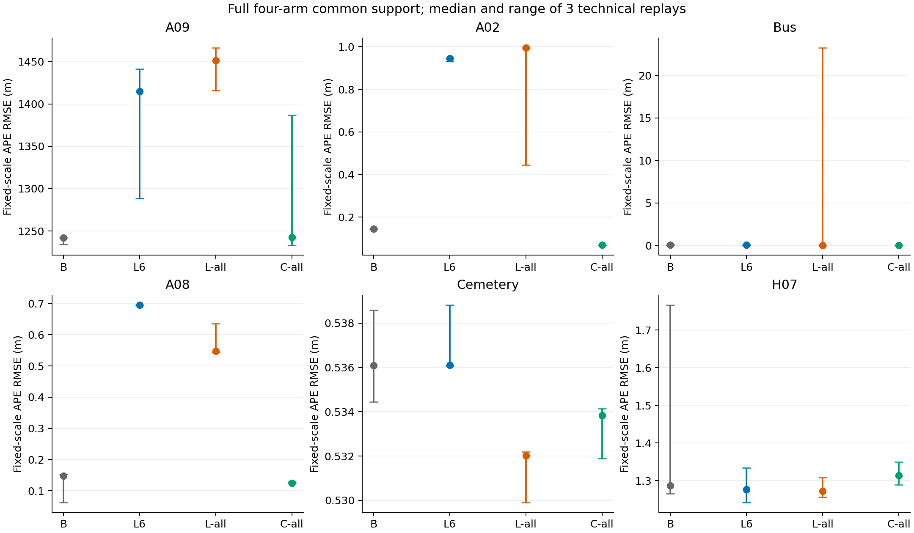
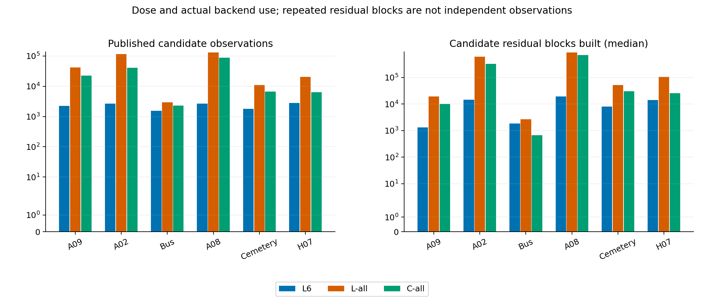

| 窗口 | 臂 | 发布总量/峰值并发 | 寿命中位/最长(观测) | APE/RPE中位(m) | 初始化成功/复放输出 | reset代理总数 | 两源共享生成/合并/后端(s) |
|---|---|---:|---:|---:|---:|---:|---:|
| A09 | B | 0/0 | 0/0 | 1242.14/150.847 | 3/3；3/3 | 0 | 复用/2.27178/60.3217 |
| A09 | L6 | 2251/6 | 4.0/96 | 1415.07/171.485 | 3/3；3/3 | 0 | 833.056/9.62205/60.421 |
| A09 | L-all | 42018/262 | 7.0/192 | 1451.2/175.768 | 3/3；3/3 | 0 | 833.056/12.3511/60.5254 |
| A09 | C-all | 22392/152 | 4.0/188 | 1242.36/150.847 | 3/3；3/3 | 0 | 833.056/10.0712/60.5236 |
| A02 | B | 0/0 | 0/0 | 0.144221/0.0211094 | 3/3；3/3 | 0 | 复用/2.34191/64.9774 |
| A02 | L6 | 2688/6 | 4.0/86 | 0.944678/0.0878391 | 3/3；3/3 | 0 | 1111.61/10.229/64.9326 |
| A02 | L-all | 116129/318 | 5.0/182 | 0.994532/0.0927771 | 3/3；3/3 | 0 | 1111.61/18.4544/64.9321 |
| A02 | C-all | 41339/132 | 15.0/143 | 0.0695174/0.016427 | 3/3；3/3 | 0 | 1111.61/12.3514/64.8355 |
| Bus | B | 0/0 | 0/0 | 0.0588963/0.0263231 | 3/3；3/3 | 0 | 复用/1.29075/64.933 |
| Bus | L6 | 1537/6 | 2.0/51 | 0.061526/0.0295115 | 3/3；3/3 | 0 | 264.008/5.85015/65.1066 |
| Bus | L-all | 2963/30 | 2.0/51 | 0.0439087/0.0262228 | 3/3；3/3 | 0 | 264.008/5.80552/65.14 |
| Bus | C-all | 2305/38 | 1.0/47 | 0.0380845/0.0262852 | 3/3；3/3 | 0 | 264.008/5.71458/64.7022 |
| A08 | B | 0/0 | 0/0 | 0.147626/0.0334238 | 3/3；3/3 | 0 | 复用/4.34369/65.4591 |
| A08 | L6 | 2688/6 | 6.0/112 | 0.695554/0.0694114 | 3/3；3/3 | 0 | 1261.69/12.267/65.4385 |
| A08 | L-all | 130866/348 | 8.0/299 | 0.548041/0.0576591 | 3/3；3/3 | 0 | 1261.69/22.3679/65.3873 |
| A08 | C-all | 87401/251 | 18.0/200 | 0.124623/0.0325478 | 3/3；3/3 | 0 | 1261.69/17.5445/65.5334 |
| Cemetery | B | 0/0 | 0/0 | 0.536083/0.0653945 | 3/3；3/3 | 0 | 复用/1.82876/65.0416 |
| Cemetery | L6 | 1792/6 | 2.0/26 | 0.536109/0.0654828 | 3/3；3/3 | 0 | 385.403/7.04223/65.0379 |
| Cemetery | L-all | 10977/149 | 2.0/39 | 0.532015/0.0650534 | 3/3；3/3 | 0 | 385.403/7.67854/64.8376 |
| Cemetery | C-all | 6656/88 | 2.0/28 | 0.533841/0.0651576 | 3/3；3/3 | 0 | 385.403/7.3567/64.9442 |
| H07 | B | 0/0 | 0/0 | 1.28658/0.231179 | 3/3；3/3 | 0 | 复用/2.53797/69.9381 |
| H07 | L6 | 2801/6 | 3.0/58 | 1.27628/0.213095 | 3/3；3/3 | 0 | 447.013/10.7068/69.8435 |
| H07 | L-all | 20346/117 | 3.0/95 | 1.27235/0.215416 | 3/3；3/3 | 0 | 447.013/11.9119/69.8628 |
| H07 | C-all | 6422/54 | 2.0/53 | 1.31357/0.227691 | 3/3；3/3 | 0 | 447.013/11.2093/70.0018 |

取消6条并发配额确实增加了实际剂量，但仅A08相对L6达到实用改善；六窗L-all相对完整B均无实用改善，其中三窗实用退化。

日期：2026-09-08；实验线 frontend_additive_budget_v1，版本v1。前端24/24，正式尝试72/72，三技术重复，复用旧后端结果0次。原B bag只读复用，不计作新KLT推理。

完整数量对照如下，方向变化不自动等同实用改善：

| 窗口 | L6触顶帧 / L-all>6帧 | 发布倍率 | 实际候选残差倍率 | 常规求解总时间倍率 | APE变化% / RPE变化% | 冻结判断 |
|---|---:|---:|---:|---:|---:|---|
| A09 | 346 / 337 | 18.6664 | 14.8049 | 1.03113 | 2.55352 / 2.49764 | SMALL_OR_UNCERTAIN |
| A02 | 448 / 448 | 43.2028 | 41.7132 | 1.18471 | 5.27726 / 5.62167 | SMALL_OR_UNCERTAIN |
| Bus | 227 / 212 | 1.92778 | 1.44839 | 0.877291 | -28.6339 / -11.1438 | SMALL_OR_UNCERTAIN |
| A08 | 448 / 448 | 48.6853 | 45.9306 | 1.19879 | -21.2079 / -16.9315 | PRACTICAL_GAIN |
| Cemetery | 266 / 256 | 6.12556 | 6.44421 | 1.02281 | -0.763544 / -0.655677 | SMALL_OR_UNCERTAIN |
| H07 | 461 / 457 | 7.26383 | 7.2851 | 1.08904 | -0.308081 / 1.08923 | SMALL_OR_UNCERTAIN |

| 固定对比 | 实用改善 | 实用退化 | 小幅或不确定 | 不可作精度判断 |
|---|---:|---:|---:|---:|
| L-all_vs_L6 | 1 | 0 | 5 | 0 |
| L6_vs_B | 0 | 3 | 3 | 0 |
| L-all_vs_B | 0 | 3 | 3 | 0 |
| C-all_vs_B | 2 | 0 | 4 | 0 |
| L-all_vs_C-all | 0 | 3 | 3 | 0 |

以上是六个目的性开发窗的描述计数，不是总体成功率。五类固定对比的全部30行及精确数值见[comparisons.csv](comparisons.csv)。APE与RPE必须使用同一对比的共同支撑；主表是另行计算的四臂共同支撑。初始化成功仅表示日志事件，不代表尺度可靠或定位准确。
C-all在A02、Bus相对B达到实用改善，其他四窗不确定。当前结果允许说传统添加方案也可产生收益；不能声称学习来源不可替代，亦不能在剂量/q/成本不同的条件下作纯来源因果比较。

必须保留的负结果：Bus的L-all/L6专属共同支撑中，L-all三重复APE为23.252566、0.042619、0.043909m，首重复明显失稳，不能用中位数下降掩盖。A09四臂均与参考存在严重尺度失配；A08虽L-all/L6达到实用改善，学习两臂仍明显差于完整B。这些是端到端观察，具体机制为Hypothesis / Inference，详[Bus检查点](checkpoint_bus.md)、[A08检查点](checkpoint_a08.md)和逐次表。

原始KLT在全部合并中保持时间戳、ID、相机、坐标、速度和原通道；移除追加尾部可序列化重建B，非feature消息一致。六窗L6/L-all各只读同一份XFeat流，按源ID和精确时间戳核对观测子集。公开间断后新ID，无未来寿命选择或历史倒填。[逐帧数量](frontend_frame_counts.csv)包含9756行；[独立读回核验](delivery_readback_audit.csv)直接核对源坐标/q、速度及后端逐ID接收。

all仅针对top_k=2048、每次最多60新种子、私有池最多800的冻结生成器。正常GFTT候选使用1024角点供给，其他通用跟踪/几何/去重共享。实际源池限额事件与拒绝统计见[source_supply.csv](source_supply.csv)、[rejection_summary.csv](rejection_summary.csv)。没有根据效果改门或静默裁剪全部臂。

共享两源生成耗时在同窗三添加臂重复展示，仅实际执行一次，不能相加。图像尺寸/实测原始帧数、模块计时及进程峰值RSS见[frontend_window_resources.csv](frontend_window_resources.csv)。B生成耗时为Unknown（只读复用）；表中B合并时间主要是读回审计，后端时间为三重复墙钟中位，含ROS启动、播放、排空与收尾。L6/L-all共用完整XFeat推理，不可声称6条配额减少本轮网络推理成本。A09及A02前段源生成尚未固定CPU亲和；宿主非排他，Bus部分运行期间另有编译任务，严格无干扰性能排名Not evaluated.。

后端四臂使用同一只读诊断二进制，容量仍1000，无容量扩展；实际逐ID接收、>=4观测资格、真正加入问题的投影残差、solver用时及RSS见[backend_results.csv](backend_results.csv)。计数可跨优化重复使用观测；可运行不等于正确尺度。工程保护结果保留在72行分母。solver接近上限为elapsed>=95%预算，实际达到为elapsed>=预算，不能据此唯一识别停止原因。
Confirmed fact：72次最终运行检查、36组共同支撑/evo均通过，逐ID接收72/72完整；最大实际优化资格834<1000，没有容量扩展或静默裁剪。solver统计仅覆盖常规非线性优化，初始化SfM求解耗时/触限为Unknown。完整源/依赖/后端/30项窗口输入配置哈希复核见[frozen_contract_final_verification.json](frozen_contract_final_verification.json)。
后端RSS为播放期间每0.5秒采样的已观测峰值，非全生命周期严格峰值；GPU峰值内存Unknown。逐臂三重复的最小/中位/最大汇总见[backend_arm_summary.csv](backend_arm_summary.csv)，包含首次位姿延迟、实际使用、容量、solver、RSS和尺度。公开ID数、>=4及>=10观测长链见[frontend_audit.csv](frontend_audit.csv)，逐链寿命见[candidate_lifecycle.csv](candidate_lifecycle.csv)。

三重复按中位数和全范围报告。未执行总体显著性推断，依据及效应量见[统计附录](analysis-output/stats-appendix.md)。六窗是已知结果的开发窗，参考为COLMAP/proxy；添加观测从同一起点介入，可改变初始化，不能主张共同初始化后的纯跟踪效应。

图1用于核对各窗精度和技术波动。误差条不是置信区间；A09相对参考的尺度失配必须保留，不能只强调初始化成功。预注册的胜负仍以两臂专属共同支撑为准。

图2区分“发布了更多点”与“后端实际用了多少约束”。二者都不能直接证明新增独立信息或定位收益。

已知实现边界：[implementation_audit_notes.md](implementation_audit_notes.md)。XFeat与C的冻结vins_safe来源映射不同，实际q范围见[source_weight_audit.csv](source_weight_audit.csv)，加上供给与耗时不同，仅允许整个来源方案比较。逐私有ID的确切死亡原因Unknown；有按类累计FB/NCC/边界死亡和几何/质量/去重拒绝，不能逐链唯一归因。receipt.started_at实际为收尾写入时间；墙钟用时有效，精确启动墙钟Unknown。

执行偏差：Cemetery首次源生成遇到raw190/191异图同时间戳，358源记录对357个原B时刻，合并身份门拒绝，后端未使用该流。原产物全部隔离保存，随后按已冻结2/0帧索引补上输出关联条件，恢复前另行冻结一行overlay。Cemetery因此有两次生成尝试，其他五窗一次；正式L6/L-all仍共享唯一有效源流。失败尝试精确额外墙钟Unknown，不能记为零或隐瞒。详[cemetery_recovery_addendum.md](cemetery_recovery_addendum.md)、[失败清单](cemetery_invalid_attempt.json)、[六窗帧索引核对](all_window_frame_alignment_audit.json)。原冻结runner和门限未修改；这是结构修复，不能作为方法效果证据。

复现入口：[preregistration.md](preregistration.md)、[源与输入锁](source_and_backend_lock.json)、[后端执行锁](backend_execution_lock_v2.json)、[评估锁](evaluation_lock.json)、[完整分析](analysis-output/analysis-report.md)、[图解释](analysis-output/figure-catalog.md)。运行大文件保留于独立运行目录，哈希可核查，未上传bag、权重或大日志。报告使用用户指定路径，未尝试Obsidian写回。

当前唯一下一步：用已保存的逐ID、初始化和尺度日志做一次失稳归因审计，重点检查Bus异常重复及A02/A08学习添加退化；不自动扩数量或新增时机变体。
