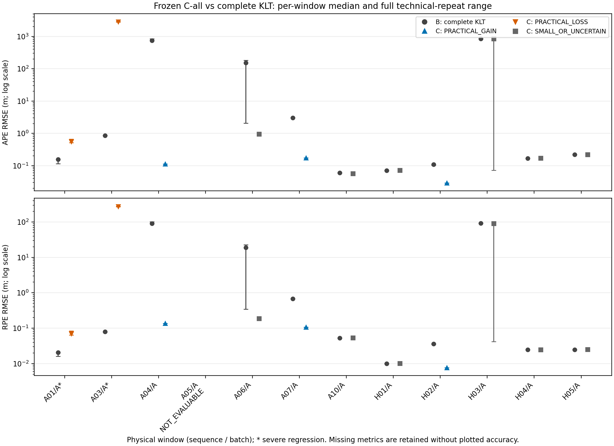
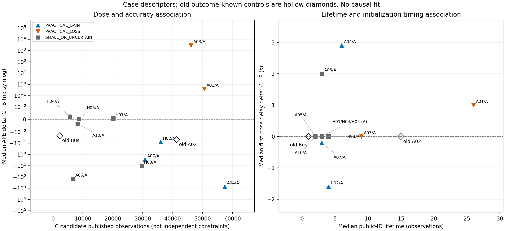

# 固定 C-all 的新窗口机会扩展：最终报告

**Confirmed fact. 新窗口中存在跨序列的局部实用收益，但严重退化超过冻结风险上限；最终为 `ADDITIVE_OPPORTUNITY_NOT_GENERALIZED`，在 Batch A 后停止扩展。** C-all 的身份仍是 classical positive control / additive observation probe，不是 AQUA-FE 最终创新。以下均限定于本次冻结输入、冷启动、固定后端和 COLMAP/proxy 参考，不能解释为独立 GT 下的总体效果。

| 用户要求的首屏问题 | 最终回答 |
|---|---|
| 1. 实际新物理窗口数 | **12 个**，每窗 B×3、C-all×3，共 **72 次正式 replay**；完整分母保留全部 12 窗。 |
| 2. held-out 类型 | **12 sequence-held-out、0 window-held-out**，只相对于原六个 C-all 开发窗。更广项目历史审计发现 Batch A 的 7/12 与已检查的旧区间重叠；其余也不宣称全项目从未使用。 |
| 3. 全部分层计数 | **PRACTICAL_GAIN 3；PRACTICAL_LOSS 2；SMALL_OR_UNCERTAIN 6；FAIL 0；NOT_EVALUABLE 1。** |
| 4. robust 数量 | **3 个 ROBUST_PRACTICAL_GAIN**，是上述 3 个 practical gain 的子集，不能再次相加。另有 3 个仅 DIRECTIONAL_GAIN，仍属 small/uncertain。 |
| 5. 正例是否跨序列 | **是：A04、A07、H02，共 3 条序列。** |
| 6. 新严重退化 | **2 个：A01、A03**，均为 practical loss；超过允许的最多 1 个。 |
| 7. 与旧 A02/Bus 有何区别 | 新正例发布量 A04/A07/H02 为 **57,373/30,732/35,978**，寿命中位数 **6/3/4 次观测**，C−B 首姿态延迟 **+2.900/−0.200/−1.599 s**。旧 A02/Bus 为 **41,339/2,305**、寿命 **15/1 次**、延迟中位数差均 **0 s**。新收益并不要求更长寿命或更早首姿态；详见下表的消息数和条件差异。 |
| 8. 是否执行 Batch B | **没有。** 预先冻结的另 12 窗保留为 NOT_ACTIVATED / Not evaluated.，未替换、未生成新 C 输入或追加正式后端。 |
| 9. 支持哪个决策 | **ADDITIVE_OPPORTUNITY_NOT_GENERALIZED**；**EXPANSION_STOPPED_AFTER_BATCH_A**。含义是局部收益存在，但“收益且严重风险可接受”的联合条件未通过。 |
| 10. 交给机制研究的案例 | 正例 A04/A07/H02；严重负例 A01/A03；稳定小变化 A10/H01/H04/H05；初始化与重复异常 A01/A04/A06/H03；基线异常 A04/A06/H03；参考不足 A05。 |
| 11. 唯一下一步 | **交接 observation-utility / risk mechanism research。** 停止把 additive observation 作为主要研究假设继续扩展；本任务不再调 C-all、不追加学习臂、不搜索替代窗口。 |

计数和首屏数值来源：[decision.json](decision.json)、[case_registry.csv](case_registry.csv)、[old_positive_comparison_reference.csv](old_positive_comparison_reference.csv)、[history audit](broader_history_exposure_audit.csv)。集合级正/负例不得转换成其中每条 candidate 的正/负标签。

## 实验身份与冻结边界

本轮是用户独立授权的新问题，基于 `49c02471716e8ac960e35dd9dd44ef6fbb1428c6`，工作树 `/home/ma/AQUA-FE_WS_classical_opportunity_expansion_v1`，分支 `exp/classical-opportunity-expansion-v1-20260908`。旧 continuation 的 `NO_EXPANSION` 和 additive-budget 全部结论保持原样。旧 C-all/B 为 2 gain、0 loss、4 small/uncertain（正例 A02、Bus），旧 L-all/B 为 0/3/3 且六窗均已有充分剂量差；本轮没有重新用“学习点不够多”解释旧结果。[旧比较表](../frontend_additive_budget_v1/comparisons.csv)

窗口长度与 stride 均为 900 raw frames，从索引 0 顺序枚举。固定序列 A01/A03/A04/A05/A06/A07/A10/H01/H02/H03/H04/H05 各第一窗 `[0,900)` 进 A、第二窗 `[900,1800)` 进 B。全集 112 窗，100 个结构合格、12 个不完整尾窗排除，24 个按预算选定；剩余合格窗不因精度、图像质量或候选量排除。[完整冻结清单](window_roster_frozen.csv)、[batch_plan.json](batch_plan.json)

两批具体窗口在 `881dad7` 中一次性冻结并推送回读，方法/执行身份在 `8f323ba` 锁定，均先于新 C 生成和后端精度。六个旧开发窗及重叠段未进入本轮；held-out 只针对这六窗。更广历史中 A03/A05/A06/A07/A10/H02/H04 与已检查旧记录重叠。历史审计在不改变清单的前提下披露曝光，不能据此重选“更干净”窗口；未找到重叠也不是全局无曝光证明。[preregistration.md](preregistration.md)、[历史审计来源](broader_history_audit_provenance.json)

B 为每窗新生成的完整 KLT（350 cap，every_n=2/offset=1，adaptive CLAHE，vins_safe）。C 保留 B 每条消息的完整观测，只追加既有 classical pool：GFTT 1024/.01/8/3、LK21/3、FB1、NCC .65、border8、age≥3、quality≥.10、既有 FEH/residual、18 px 邻域去重、60 seeds/call、800 private pool、q floor .80/alpha .65、公开 ID `[10000000,2^24)`，均未调节。

仅移除未使用的 XFeat 源和学习输出臂、重定向路径，并采用已审计的帧关联 guard；C 的候选数学实现保持旧版本。旧 A02 上 40 raw frames/20 输出消息的有限前缀比对中，822 个 candidate observations 与旧 C 流完全相同；这只是有界等价探针，不冒称已测全数据逐帧等价。随后新窗均通过独立发布回读。[execution_notes.md](execution_notes.md)、[source_and_backend_lock.json](source_and_backend_lock.json)

后端只读复用既有 capacity=1000 诊断二进制，solver .04 s/8 iterations、loop=0、multiple_thread=0；相机族配置保持对应旧快照，只有输出/相机文件路径按新目录适配。没有修改外部 VINS 工作区或 `uw_frontend` 受保护源码。[backend_execution_lock_v2.json](backend_execution_lock_v2.json)

## 评价和统计口径

主指标为 fixed-scale proper SE(3) APE RMSE；护栏为 strict 1 s aligned-global positional-delta translational RPE RMSE，均越低越好。每窗仅使用该 B/C 六轨共同的 1 Hz 支撑：≥30 poses、≥10 s、coverage≥70%、≥10 RPE pairs；参考插值 gap≤2.5 s、估计 gap≤.25 s；evo 差≤1e-6 m。Sim(3)/fitted scale 仅诊断，不替换主指标。COLMAP/proxy **不是独立 GT**。[evaluation_lock.json](evaluation_lock.json)、[common_support_status.csv](common_support_status.csv)

冻结判断使用三技术重复中位数，收益须越过 max(5% B APE, .01 m) 并严格大于最大臂内 APE range，且 RPE 不越过冻结护栏；损失包含 APE 和 RPE 分支。严重退化使用冻结 10%/绝对下限/range 条件，或 B 全有效时新增 C failure。ROBUST 描述层级还要求 C 的完整 APE 范围优于 B，RPE 范围稳定且无新增 reset/failure 事件。精确可执行定义与公式见[预注册](preregistration.md)，本轮未改变门槛。

物理窗口是案例单位，三重复仅描述技术波动。这里没有随机总体样本、独立物理复测或独立 GT；不以 72 当科学样本量，不估计自然正例率，不跨异质窗口混算平均 APE，不报告虚构显著性或人口置信区间。统计检验、总体 CI：**Not evaluated.** [统计附录](analysis-output/stats-appendix.md)提供原因；[精确数值表](analysis-output/exact_numeric_summary.csv)含全范围、原始/相对中位数差及辅助技术均值/样本 SD。

## 全部 12 窗结果

以下每个窗口均是 AQUALOC 对应序列 raw `[0,900)`，使用上面的同一 B/C 合同和自身六轨支撑。数值按 **min / median / max** 排列，单位 m；完整逐重复值与 run 路径见 [backend_results.csv](backend_results.csv)。P/G/S/N 分别表示 PRACTICAL_LOSS / PRACTICAL_GAIN / SMALL_OR_UNCERTAIN / NOT_EVALUABLE；星号表示 severe regression。

| 序列 | 分类 / 层级 | B APE min/median/max | C APE min/median/max |
|---|---|---|---|
| A01 | P* / NONE | 0.114752529 / 0.155036765 / 0.155036765 | 0.510392946 / 0.554980933 / 0.658114201 |
| A03 | P* / NONE | 0.854466501 / 0.858028459 / 0.861665143 | 2781.31691 / 2854.46348 / 2867.04419 |
| A04 | G / ROBUST_PRACTICAL_GAIN | 743.154136 / 743.154136 / 837.552376 | 0.113787741 / 0.113799385 / 0.113804002 |
| A05 | N / NONE | Not evaluated. | Not evaluated. |
| A06 | S / DIRECTIONAL_GAIN | 2.0503863 / 151.785956 / 183.491589 | 0.948918366 / 0.950726461 / 0.970375813 |
| A07 | G / ROBUST_PRACTICAL_GAIN | 3.04255487 / 3.04441207 / 3.05375437 | 0.173394771 / 0.173395778 / 0.173400551 |
| A10 | S / DIRECTIONAL_GAIN | 0.0598424108 / 0.0600754758 / 0.0604783611 | 0.0564900183 / 0.0566183871 / 0.0566204493 |
| H01 | S / NONE | 0.0707647036 / 0.0707647266 / 0.0708979931 | 0.0712007908 / 0.0715236208 / 0.0715517585 |
| H02 | G / ROBUST_PRACTICAL_GAIN | 0.10341843 / 0.109391832 / 0.110284447 | 0.0293568014 / 0.0294124238 / 0.0294125674 |
| H03 | S / DIRECTIONAL_GAIN | 848.004116 / 848.216346 / 848.384525 | 0.0714667971 / 837.927196 / 838.008913 |
| H04 | S / NONE | 0.168902955 / 0.168906392 / 0.168929025 | 0.1711044 / 0.171106054 / 0.171399337 |
| H05 | S / NONE | 0.218331637 / 0.218333457 / 0.218334404 | 0.218611866 / 0.218612648 / 0.218617415 |

| 序列 | B RPE min/median/max | C RPE min/median/max | 共同 poses / span s / coverage / pairs |
|---|---|---|---|
| A01 | 0.0159967189 / 0.0206573589 / 0.0206573589 | 0.0645996178 / 0.0701269048 / 0.083283315 | 36 / 35.0 / 81.8182% / 35 |
| A03 | 0.0786331143 / 0.0789517215 / 0.0792160607 | 270.935815 / 277.286662 / 278.489161 | 42 / 41.0 / 95.4545% / 41 |
| A04 | 90.4247419 / 90.4247419 / 102.934309 | 0.137629842 / 0.137633285 / 0.137634938 | 31 / 35.0 / 70.4545% / 29 |
| A05 | Not evaluated. | Not evaluated. | 27 / 26.0 / 100.0000% / 26 |
| A06 | 0.342113357 / 19.1366191 / 22.9410663 | 0.184862927 / 0.187005995 / 0.187111853 | 37 / 36.0 / 84.0909% / 36 |
| A07 | 0.681967929 / 0.682203014 / 0.682984439 | 0.106702305 / 0.106704849 / 0.106704874 | 36 / 38.0 / 80.0000% / 34 |
| A10 | 0.0522365156 / 0.0522425328 / 0.052250603 | 0.0536714016 / 0.0536910105 / 0.0536916665 | 40 / 39.0 / 93.0233% / 39 |
| H01 | 0.00997388835 / 0.0099739335 / 0.0100754855 | 0.00993252802 / 0.0101086606 / 0.0101447869 | 42 / 41.0 / 93.3333% / 41 |
| H02 | 0.0347264859 / 0.0362120603 / 0.0363649308 | 0.00768504874 / 0.00768785733 / 0.00768837201 | 41 / 40.0 / 91.1111% / 40 |
| H03 | 91.9907625 / 92.0194671 / 92.0376106 | 0.041547272 / 90.9659703 / 90.9725693 | 43 / 42.0 / 95.5556% / 42 |
| H04 | 0.0245472224 / 0.0245550629 / 0.0245880095 | 0.0246311511 / 0.0246318658 / 0.0247845741 | 43 / 42.0 / 95.5556% / 42 |
| H05 | 0.0247827835 / 0.0247828045 / 0.0247831218 | 0.0248759985 / 0.0248772024 / 0.0248777417 | 43 / 42.0 / 95.5556% / 42 |

A05 的 100% 是较短参考支撑网格的覆盖，并非整段 raw 窗口参考完整：参考 span 26.996555 s、raw 约 44.94 s，只得 **27 common poses<30**，因此即使 26 个 RPE pairs 足够、六次运行都完成，仍禁止 B/C 精度比较。其余 11 窗通过全部共同支撑门槛；A04 的 31 poses、70.4545% coverage 接近下限，单独标明。A05 的传感器首姿态出现在 raw 开始后 1.350783 s；相对晚开始的参考为 −15.646495 s，不是“负耗时初始化”。[A05 support](common_support/coe1_a05_00000_00900/C-all_vs_B/common_support_summary.json)、[完整案例表](case_registry.csv)

## 图和机制案例解读

图 1 保留 12 窗的位置，以对数轴同时显示正常量级和数值异常。A04/A07/H02 的 C 完整范围均满足 robust 描述条件；A01/A03 是新严重负例。A06 虽有较大的中位数下降，但下降 150.835229 m 小于最大臂内范围 181.441203 m，冻结规则不允许把它升级为 practical gain。H03 的 C 范围跨约 .071–838 m，不能挑选唯一好重复。误差条是技术 min–max，不是置信区间。[图目录与可编辑 SVG](analysis-output/figure-catalog.md)

- **A04：异常基线被改善的正例。** B APE 中位数 743.154136 m、C .113799 m；B fitted scale 约 .001036、C 约 .958281。C 首姿态反而晚约 2.900 s。它支持本合同下集合级改善，不能描述成“原本可靠基线的常规小幅提升”，也不能据此确认初始化因果机制。
- **A07 与 H02：另两类正例。** A07 APE 3.044412→.173396 m；H02 .109392→.029412 m、RPE .036212→.007688 m。H02 的 B scale 1.045307、C .980834，属于中等误差基线获益，不依赖 A04 式基线数值爆炸。C 首姿态分别早约 .200 s、1.599 s；这仍是关联。
- **A01 与 A03：严重风险案例。** A01 APE .155037→.554981 m、RPE .020657→.070127 m；较长候选寿命不能保证安全。A03 三个 C APE 都在 2781–2867 m，而 B 约 .858 m；B/C 首姿态延迟同为 1.250174 s，misalignment 记录均为零，说明这些简单初始化摘要没有排除严重数值风险。原因 **Unknown**。
- **A06 与 H03：不能被“中性”掩盖的异常。** A06 B APE 2.050386/151.785956/183.491589 m，基线技术不稳定；misalignment 计数 B/C 中位数 22/31。H03 B 一直约 848 m，C r1/r2/r3 APE 为 837.927196/838.008913/.071466797 m；相同发布 bag 下 candidate residual blocks 为 29,806/29,806/199,867，C scale 由约 .000155 到 .858476。运行 PASS 不等于数值可靠；相对 severe=False 也不是绝对可靠性证明。
- **A10/H01/H04/H05：有实际追加作用量的小变化案例。** A10 APE 小幅下降但 RPE 小幅增加；其余三窗两个中位数略增，均未达到 practical loss。它们不是零动作对照，不能把中性解释为 candidate 未送入后端。

这些数值与诊断来自[案例表](case_registry.csv)、[逐重复表](backend_results.csv)及对应的 [run receipts](run_receipts/)。没有新增 reset/failure-detection 日志事件；真实 lost-tracking 计数 **Unknown**，零代理事件不能排除数值发散。

图 2 左侧显示集合发布量与 APE 中位数差，右侧显示公开 ID 寿命与首姿态延迟差；空心菱形为旧 A02/Bus，不计入新窗分母。A05 仅保留可观察的时序背景、不画精度点；重合 H01/H04/H05 标签合并显示，数值没有抖动。大剂量区域同时包含 A04 正例和 A01/A03 负例；新正例中既有首姿态更早也有更晚的情况。**Hypothesis / Inference.** 候选总量、寿命或单一初始化延迟难以单独解释集合级效用，值得做风险机制分析；本图没有建立准入阈值或因果关系。

## 与旧 A02 / Bus 的正例背景对比

| 窗口 | 输出消息数 | C 发布 observations | 每消息 observations | unique IDs | ≥4 / ≥10 IDs | 寿命 median/max（观测数） | B→C 首姿态延迟中位数（s，相对各自参考起点） |
|---|---:|---:|---:|---:|---:|---:|---|
| 旧 A02 | 450 | 41339 | 91.864 | 1725 | 1286 / 1030 | 15.0 / 143 | 2.949270 → 2.949270 |
| 旧 Bus | 282 | 2305 | 8.174 | 752 | 189 / 47 | 1.0 / 47 | 2.391125 → 2.391125 |
| 新 A04 [0,900) | 450 | 57373 | 127.496 | 4843 | 2971 / 1745 | 6.0 / 195 | 4.748619 → 7.648394 |
| 新 A07 [0,900) | 450 | 30732 | 68.293 | 4890 | 2197 / 897 | 3.0 / 121 | 5.249194 → 5.049252 |
| 新 H02 [0,900) | 450 | 35978 | 79.951 | 4319 | 2360 / 1190 | 4.0 / 106 | 3.149432 → 1.550007 |

来源：[old_positive_comparison_reference.csv](old_positive_comparison_reference.csv)、[case_registry.csv](case_registry.csv)。旧 A02 为 raw [0,900)，Bus 为 s180/d45；各自采用原 C/B 六轨支撑，不做跨数据集绝对误差排名。旧 A02 候选残差块每重复 320,348；旧 Bus 为 618/672/747，和新正例实际后端使用程度明显不同。Residual blocks 可在多次优化中重复使用同一观测，不是独立几何约束数。

新 A04/A07/H02 发布寿命秒数中位数约 .494/.200/.300 s，公开寿命计数分别 6/3/4；秒数跨度与观测次数分别报告，不能相互冒充。寿命是窗口内公开链观测，受窗口截断和准入起点影响，不是完整生存分析；private termination 原因 **Unknown**。旧 Bus 约 23 m 的单次异常属于旧 **L-all**，不能误归给旧 C-all；本报告以已核实的旧 C-all 完整范围为准，保留旧结论不重判。

## 工程审计、成本及失败记录

[final_integrity_audit.json](final_integrity_audit.json) 为 **PASS**：12 窗、72 次正式回放，1,656 个唯一产物哈希无不一致；输入 bag、B/C bag、配置与只读 binary、执行/评价源码锁一致。所有已运行窗的 B 逐消息完整保留、non-feature 消息一致、公开 ID/float32、源坐标/q/velocity 回读通过；后端逐 ID 接收完整，没有静默裁剪证据。72 次均达到冻结 runability，实际最大 eligible 为 **644<1000**。保守整窗 ID 上界可能触发旧 `CAPACITY_REVIEW_REQUIRED` 文本，正式判断依据是新容量审计和 actual eligible，而非宽松上界。[delivery_readback_audit.csv](delivery_readback_audit.csv)、[capacity/](capacity/)、[run_receipts/](run_receipts/)

11 个有效比较的最大 evo 差为 **4.9937014e-7 m < 1e-6 m**。最终审计重新使用冻结分类函数，全部分类、层级、severe 标志与门槛一致；案例补充前后标签不变。[case_supplement_receipt.json](case_supplement_receipt.json)

运行环境为 ROS Noetic、aquafe_cuda Python 3.8，ROS master 12691，前端 CPU 0/6，后端 CPU 2/3/8/9，串行后端并限制 BLAS 线程。每次正式运行有进程、端口、锁、磁盘和内存预检；不声称连续独占整台主机，也未终止外部任务。单次后端 wall time 64.700–65.414 s，含播放/排空与包装开销，不是算法 FPS。每窗新 B 导出 226.880–654.856 s、C 生成 199.872–571.966 s，均为当前 CPU 环境阶段时间；没有据此声称实时性能。[resource_usage.csv](resource_usage.csv)、[backend_results.csv](backend_results.csv)

保留的工程问题包括：冻结前 Python 3.8 不支持 removeprefix；初次等待控制器的报告 dict-union 不兼容（未消耗正式回放）；旧 baseline wrapper 不遵循新 RUN_DIR，通过本任务自己的路径映射恢复，未补跑挑选结果。兼容适配只改执行/报告表达，不改 C 或评价数学。最初图表标签重叠，首版分析保存在 runtime/reporting_drafts；跨文件系统 rename 失败后以完整哈希核对的 move 归档，随后的覆盖保护拒绝也保留记录，最终仅调整标签。没有因科研负结果追加第四次重复。[execution_notes.md](execution_notes.md)、[最终化操作记录](finalization_notes.md)

## 信念变化、交接和复现索引

**Confirmed fact.** “离开原六个 C-all 开发窗口，局部实用收益仍可能出现”得到新 A04/A07/H02 的支持，其中 H02 排除了“收益只来自爆炸基线救回”的单一描述。**Confirmed fact.** “固定 C-all 可在此扩展清单内同时保持可接受严重风险”未通过，两处 severe 直接触发停止规则。**Hypothesis / Inference.** 应把研究重心交给何种观测有用、何时危险的机制；尚无个体特征因果证据。

下一步仅交给 observation-utility / risk mechanism research；不继续扩大 additive observation 主假设，不调 GFTT/LK/q/grid/stride，不追加 L-all/LoFTR。上述新窗口现在已 outcome-known：凡利用这些结果设计的新机制，都必须把它们当作开发/机制案例，后续确认需要另行预注册的新证据。window_id 与 public_id 组成联合键，禁止跨窗仅按 public_id 合并，也禁止把集合级胜负广播给所有 candidate。

- 完整决策与冻结证据：[decision.json](decision.json)、[checkpoint_batch_A/](checkpoint_batch_A/)、[run_receipts/batch_A_gate.json](run_receipts/batch_A_gate.json)。Batch A 检查点提交 `853cdd6011f9d3a73cfbd84e580d121530cbecdb` 已推送并远端回读。
- 数值与分析：[window_outcomes.csv](window_outcomes.csv)、[backend_arm_summary.csv](backend_arm_summary.csv)、[analysis-report.md](analysis-output/analysis-report.md)、[stats-appendix.md](analysis-output/stats-appendix.md)、[figure-catalog.md](analysis-output/figure-catalog.md)、[provenance.json](analysis-output/provenance.json)。
- 案例池：[positive_cases.csv](positive_cases.csv)、[neutral_cases.csv](neutral_cases.csv)、[negative_cases.csv](negative_cases.csv)、[failure_cases.csv](failure_cases.csv)、[sequence_distribution.csv](sequence_distribution.csv)、[candidate_lifecycle.csv](candidate_lifecycle.csv)、[source_supply.csv](source_supply.csv)。
- 机制交接：[case_mechanism_handoff.md](case_mechanism_handoff.md)；项目独立交接：[CODEX_HANDOFF_CLASSICAL_EXPANSION.md](../../docs/CODEX_HANDOFF_CLASSICAL_EXPANSION.md)。
- 本地运行根：`/media/ma/Data/AQUA-FE_WS_storage_offload/frontend_classical_opportunity_expansion_v1`；每窗 `frontend/<slug>/` 与 `backend/<slug>/{B,C-all}/repeat{1,2,3}/` 保存原始观测、轨迹和日志，Git 只发布审计与适量派生产物，不上传 bags/weights/巨大原始日志。
- 可复查脚本：`scripts/{classical_opportunity_py38,audit_classical_opportunity_final,complete_classical_opportunity_case_fields,build_classical_opportunity_analysis_bundle}.py`。最终化脚本已执行，不应在已完成目录重复运行或重启实验控制器；具体身份由锁和收据确认。

总体自然正例率、跨项目未见数据泛化、独立 GT 误差、个体 candidate utility、初始化因果链和实时在线机制：**Not evaluated.** 本次交付提供固定合同下完整且可追踪的集合级正负案例。
