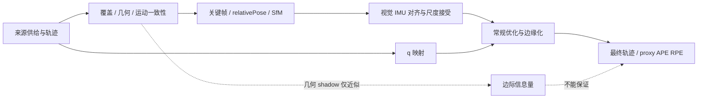
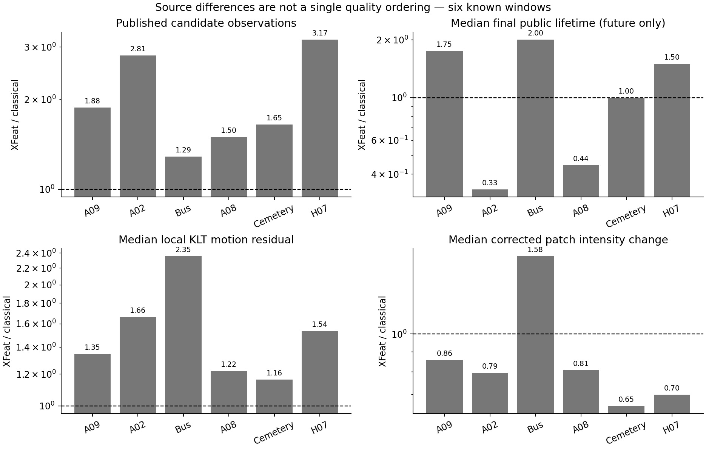
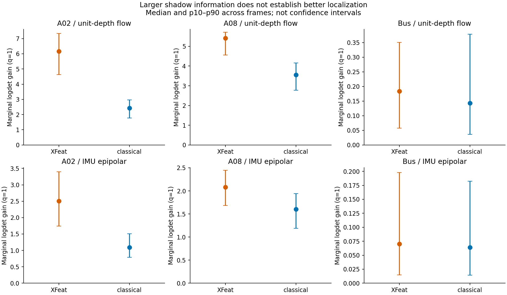
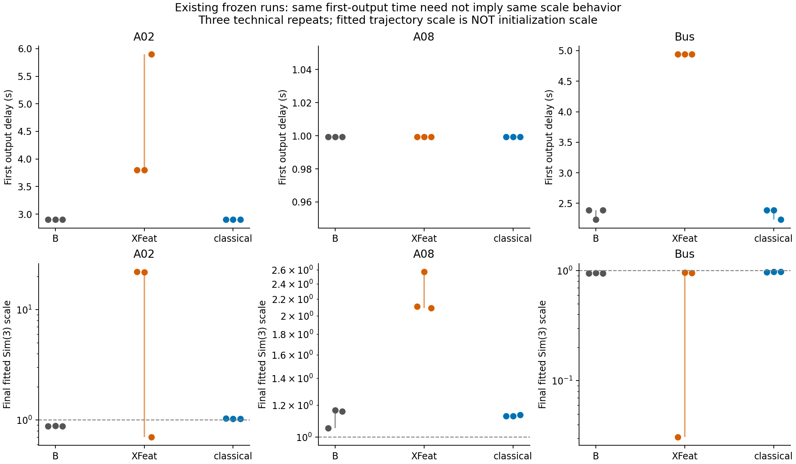
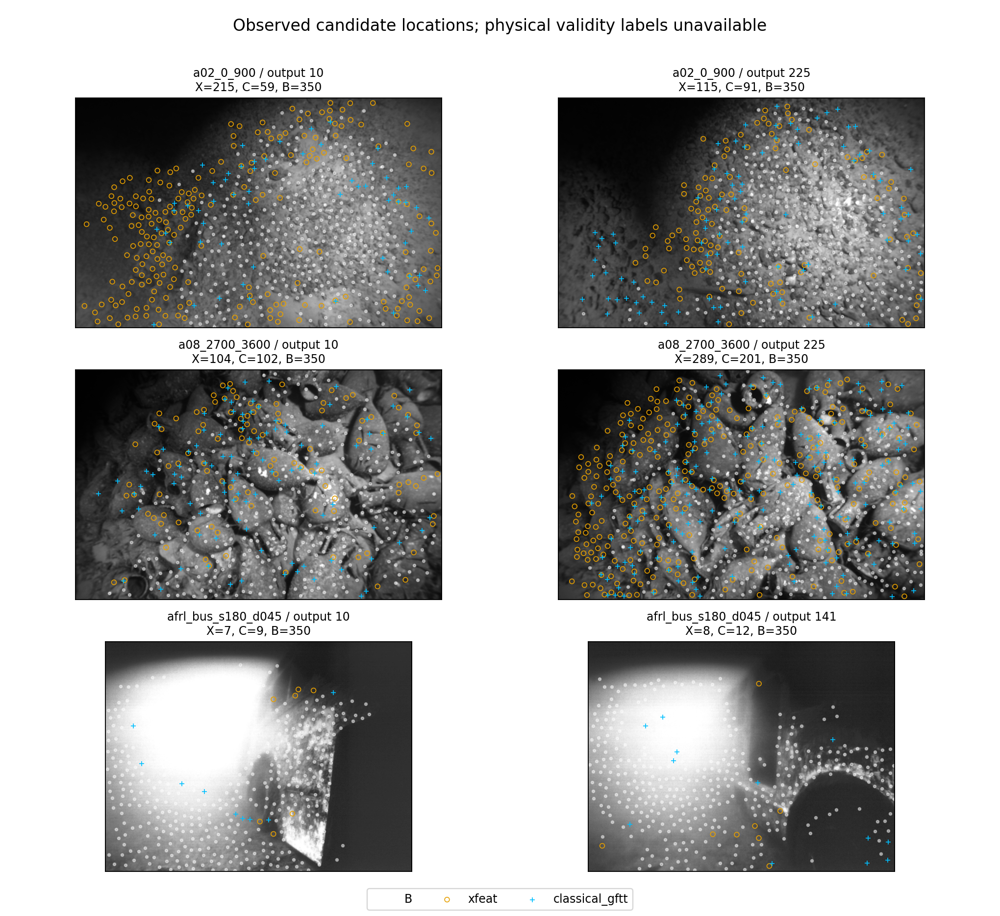

1. **为什么C-all在A02/Bus能比KLT好？** 因果原因仍Unknown。A02 classical的公开寿命更长、对邻域KLT的运动偏差更小，且保留B的对齐拒绝次数/首输出时刻；这些与正向整体干预一致。Bus classical中位寿命却只有1次，不能把两窗收益统一解释为长轨迹。没有逐候选beneficial标签。
2. **为什么L-all在A02/A08/A09没有净收益？** 剂量不足、删除KLT、未进残差已被原审计排除。A02初始化接受路径改变；A08首输出时刻相同仍退化；A09连B也严重尺度失配。新增几何shadow信息不能保护估计状态，具体scale/gravity根因仍未有效测得。
3. **数量、寿命、覆盖、parallax能解释差异吗？** 只能部分描述。XFeat在A02/A08有更多发布、更大覆盖增量，且实际长链绝对数更多，仍无净收益；C的寿命优势不跨Bus成立。不能单靠这些量推出准入规则。
4. **信息增益/冗余能解释吗？** 未得到一致的有用/有害分界。A02/A08中XFeat的两种集合shadow logdet更大，q=1后仍如此；两源都有高行方向重合与边际收益递减。残差偏差也会增加epipolar Gram的秩/谱，所谓信息增加不保证静态、无偏或完整VIO有效信息。
5. **初始化scale/gravity/alignment路径能解释吗？** 旧日志确认A02/Bus的alignment路径关联，不能跨A08归结为早/晚初始化。三组新B A/A均失败，故0/27正式诊断；新内部scale/gravity/条件谱不用于机制结论。最终Sim3拟合不能替代初始scale。
6. **有水下特有motion/photometric reliability证据吗？** 六窗XFeat相对邻域KLT的运动偏差中位数都更大（包括无实用退化的Cemetery/H07），但邻域距离、真实深度、零偏/同步是混杂。A02/A08的XFeat光度变化反而更小。静态图/patch变化无法识别颗粒、焦散或折射；真实标签Unknown，只能称UNDERWATER_RELIABILITY_HYPOTHESIS。
7. **有准入前、跨关键窗一致的风险/价值信号吗？** 尚未建立。局部运动偏差是小而可解释的候选线索，但多数双帧量来自已经公开的续传记录，首次准入私有历史缺失；有效初始化状态反馈也未获得。不能声称在线判别或泛化。
8. **下一项最小算法实验是什么？** 当前不建议算法实验。唯一下一步：先做冻结 B 的回放确定性与日志侵入性审计，查清本次 A08 冻结版异常后再恢复初始化内部诊断；暂不开发新的 admission/router。

## 身份、范围与机制差异图

2026-09-08；observation utility audit v1。源证据49c0247、旧A02初始化补充54cc31f；本轮审计/诊断源码07e59b5；补充分析源码54ac8850121ecae38289b629bd19310b4fdc0426；报告发布commit与源身份分开。本任务不修改任何旧源流、权重、算法/门/预算或六窗原结论。

完整保留KLT不会固定关键帧、SfM或初始化分支。冻结源码中初始relativePose/SfM/alignment不直接读取q，q在后续投影优化/边缘化生效；故q不是前优化路径差异的直接输入，但最终轨迹仍有q混杂。[源码审计](source_code_mechanism_audit.md)。

## 完整六窗来源与信息结果

| 窗口 | X/C发布量 | X/C寿命中位 | X/C运动偏差 | X/C光度变化 | X/C flow logdet(q=1) | X/C epi logdet(q=1) |
|---|---|---|---|---|---|---|
| A09 | 42018/22392 | 7/4 | 1.34592 | 0.857167 | 3.12958/1.32871 | 0.953621/0.619298 |
| A02 | 116129/41339 | 5/15 | 1.66452 | 0.79424 | 6.1644/2.42763 | 2.50309/1.09441 |
| Bus | 2963/2305 | 2/1 | 2.3537 | 1.58435 | 0.183774/0.143073 | 0.0700311/0.0638832 |
| A08 | 130866/87401 | 8/18 | 1.22185 | 0.80699 | 5.41922/3.55727 | 2.07912/1.60534 |
| Cemetery | 10977/6656 | 2/2 | 1.16334 | 0.653469 | 0.462909/0.329521 | 0.133514/0.162671 |
| H07 | 20346/6422 | 3/2 | 1.53643 | 0.69881 | 1.47383/0.255816 | 0.485371/0.0844755 |

表中motion/photometric列为X/C中位倍率；两个logdet列为X与C各自跨帧中位，统一q=1。全部原q、trace、min eigen、weak direction、condition变化和per-candidate边际量在[information_geometry_summary.csv](information_geometry_summary.csv)；没有事后选择矩阵指标。q/长链/覆盖/视差及每次pre/post-init分布见[candidate_source_comparison.csv](candidate_source_comparison.csv)。

此图说明四种来源排序互不等同。A02/A08 classical中位寿命较长，但XFeat的>=10次长链绝对数量仍更多；“XFeat都不持久”不准确。Bus C寿命并不更长，排除统一长寿命解释。所有候选均为原门筛过的合格集，未观察的被拒候选真实性不能倒推。

q=1后A02/A08的XFeat集合信息proxy仍更高，不能归因于仅q增大。errorbar为帧p10–p90而非独立样本CI。最近Jacobian行高度重合不代表零信息；PSD增量可在约束带偏或相关时“变好”而轨迹变坏。真实VIO Fisher、scale-sensitive Schur信息和prior稳定性尚未取得。

## 初始化路径与诊断失败

| 窗口/臂 | 首输出延迟min–max(s) | 对齐拒绝min–max | 最终Sim3 min–max |
|---|---|---|---|
| A02/B | 2.89786–2.89786 | 7–7 | 0.884375–0.884868 |
| A02/L-all | 3.79884–5.8996 | 10–17 | 0.700764–22.0652 |
| A02/C-all | 2.89786–2.89786 | 7–7 | 1.02961–1.03362 |
| A08/B | 0.999259–0.999259 | 0–0 | 1.05264–1.16648 |
| A08/L-all | 0.999259–0.999259 | 0–0 | 2.09262–2.57515 |
| A08/C-all | 0.999259–0.999259 | 0–0 | 1.12783–1.13518 |
| Bus/B | 2.23196–2.39112 | 0–0 | 0.941095–0.954398 |
| Bus/L-all | 4.9417–4.9417 | 3–3 | 0.0307419–0.959046 |
| Bus/C-all | 2.23196–2.39112 | 0–0 | 0.965622–0.978065 |

旧A02 replacement/delete提前约.898443s；新additive L-all反而更晚，不能套同一“早初始化有害”规则。Bus三次L-all同一首输出时刻而结果仍有23m级异常，时间戳/拒绝次数不能区分该异常；原日志中的线性求解失败也出现在B和C，次数不是干净的二值有害标签。A08相同时刻不同终局误差；内部scale/gravity仍Unknown。

只读日志后端先做A02/A08/Bus各1对新B A/A，总6次工程验证，0对通过；完整数值见[diagnostic_aa.csv](diagnostic_aa.csv)、[工程结果](diagnostic_engineering_results.csv)。按冻结容差停止27次正式诊断。A08本次发散发生在冻结版B，不能归因日志补丁；不能挑选更好重放替换原结果。新日志即使有内部值，也被证据门禁用。[失败说明](diagnostic_gate_report.md)。

## 水下真实性与在线可得性

固定帧可见明显非均匀照明与不同空间分布，但没有独立场景标签。局部光度变化包含曝光、视点与纹理；gyro剩余flow包含真实平移和零偏/同步误差，距离B更远也可能使局部motion偏差更大。真实颗粒/焦散/折射类别Unknown。详[underwater_reliability_audit.csv](underwater_reliability_audit.csv)。

[first_admission_availability.csv](first_admission_availability.csv)表明首次公开/重入没有前一帧合格记录，双帧运动量缺失，不能填零；只有后续观测可计算本轮的双帧量。虽然在线私有tracker原则上可保存历史，本轮没有验证这些量在首次准入的判别性。单帧unit-depth信息在首次准入可算，单独结果见[first_admission_information_summary.csv](first_admission_information_summary.csv)，仍不是实际估计器风险。

## 统计、文献与算法进入门

本轮为描述性机制发现；六物理窗已知结果、三技术重复、COLMAP/proxy非独立GT。无p值、预测准确率、独立样本CI或泛化声明。原30对比的common support及胜负不变；新A/A未做APE/RPE比较。[统计附录](analysis-output/stats-appendix.md)、[分析限制](analysis_limitations.md)。

小型一手文献核查已经确认information-aware selection、normal-epipolar selection、初始化谱稳定性、IMU prior拒绝、水下patch/descriptor真实性分类、sensor reliability及深度不确定性先例；不能把age+parallax或logdet本身称创新。[literature_gap.md](literature_gap.md)给出逐项链接与访问边界；未搜索到同一组合不等于首创。

进入新risk-aware admission的五项门当前未同时满足：跨三个关键窗的统一机制未证；first-admission因果输入存在缺失；只有近似几何shadow、无有效内部状态；来源差异只部分解释；终局q混杂未剥离。局部motion一致排序不足以覆盖这些门，且同一排序也出现在无实用退化的控制窗，缺乏结果特异性。

## 结论与复查入口

解释选项以**E：多因素共同作用、六窗尚不能可靠分解**最符合证据；对已验证在线准入量则仍是F边界。已有部分初始化路径关联与信息proxy反例，故不是完全无数据，但不构成已确认的单一因果机制。

DECISION：**PARTIAL_MECHANISM**。

唯一下一步：先做冻结 B 的回放确定性与日志侵入性审计，查清本次 A08 冻结版异常后再恢复初始化内部诊断；暂不开发新的 admission/router。

复查：[问题冻结](research_questions.md)、[一页事实表](evidence_boundary.md)、[特征字典](feature_dictionary.md)、[六窗机制表](window_mechanism_summary.csv)、[原日志事件](initialization_attempts.csv)、[分析包](analysis-output/analysis-report.md)、[决策](decision.json)。主提取脚本[analyze_observation_utility_v1.py](../../scripts/analyze_observation_utility_v1.py)，补充[admission审计](../../scripts/audit_observation_utility_admission.py)，[复现说明](reproduction.md)。大日志/逐观测gzip/二进制仅在本地runtime；未作Obsidian写回。
