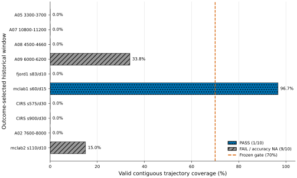
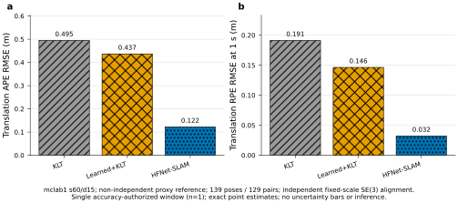

# HFNet-SLAM on the frozen old-positive roster: strict analysis

## Analysis question

在以前由 `Learned+KLT` 相对纯 KLT 产生正例的精确窗口上，外部学习特征视觉惯性 SLAM 系统 HFNet-SLAM 是否能够在**相同冷启动历史、相同窗口和相同时间支持**下运行，并在可比较时取得怎样的轨迹误差？

## Evidence boundary

- 固定名单：10 个**按既有结果选择**的历史正例窗口；这不是随机样本。
- 历史：每个窗口均为 `EXACT_WINDOW_COLD_START_NO_PRIOR_CAMERA_HISTORY`。
- 运行：每个 case 最多一次；失败后不重试、不替换、不改窗口。
- 运行性门：有效连续轨迹覆盖至少 70%；失败窗口的精度是 `NA`，不是 0。
- 精度：仅 mclab1 通过运行性门，并在 139 个共同位姿、129 个精确 1 s RPE 对、13.8 s 共同跨度上获得数值授权；独立 evo 交叉校验通过。
- 参考：mclab1 使用明确标注的 `non_independent_proxy_reference`，不是独立 ground truth；共同时间点也不是独立实验重复。
- 对齐：各臂独立进行 fixed-scale proper SE(3) 对齐，scale=1；未使用 Sim(3)。
- 推断：只有 1 个授权窗口、无重复种子，因此不做显著性检验、置信区间或标准化效应量。

## Exact roster outcome

| Window | Data | Init/reset | Poses | Coverage | KFs | Effective | Accuracy | Diagnosis |
| --- | --- | --- | --- | --- | --- | --- | --- | --- |
| A05 3300-3700 | AQUALOC | 3/3 | 0 | 0.00% | 0 | FAIL | NA | 3 init / 3 reset; no trajectory; pre-watchdog attempt ended by SIGTERM |
| A07 10800-11200 | AQUALOC | 0/0 | 0 | 0.00% | 0 | FAIL | NA | no initialization; confirmed zero-KF save hang |
| A08 4500-4660 | AQUALOC | 1/1 | 0 | 0.00% | 0 | FAIL | NA | initialized then reset; confirmed zero-KF save hang |
| A09 6000-6200 | AQUALOC | 1/0 | 68 | 33.83% | 21 | FAIL | NA | normal exit with a valid but sub-threshold trajectory fragment |
| fjord1 s83/d10 | NTNU | 0/0 | 0 | 0.00% | 0 | FAIL | NA | no initialization; SIGSEGV after zero-KF save signature appeared |
| mclab1 s60/d15 | NTNU | 1/0 | 290 | 96.67% | 56 | PASS | AUTHORIZED | normal exit; continuous trajectory passes the frozen gate |
| CIRS s575/d30 | CIRS | 0/0 | 0 | 0.00% | 0 | FAIL | NA | startup abort: Camera.fps YAML node is not an integer |
| CIRS s900/d30 | CIRS | 0/0 | 0 | 0.00% | 0 | FAIL | NA | startup abort: Camera.fps YAML node is not an integer |
| A02 7600-8000 | AQUALOC | 0/0 | 0 | 0.00% | 0 | FAIL | NA | no initialization; confirmed zero-KF save hang |
| mclab2 s110/d10 | NTNU | 3/2 | 30 | 15.00% | 6 | FAIL | NA | 3 init / 2 reset; only the final short trajectory fragment survived |

冻结名单的描述性通过数为 **1/10**。另外 9 项均保留为 FAIL/accuracy NA：5 项没有形成可用跟踪（含 0-KF 保存或 SIGSEGV），2 项只有低覆盖轨迹，2 项因 CIRS `Camera.fps` YAML 类型不兼容而在启动时 abort。这个 1/10 不能解释为总体成功概率，因为窗口是按既有 `Learned+KLT > KLT` 结果选择的。

## Authorized common-support comparison: mclab1 s60/d15

共同支持覆盖为 **92.67%**（139/150），共同跨度 13.8 s；误差越低越好。以下为相对非独立 proxy reference 的单窗口点估计，不是独立 ground-truth 误差或跨窗口均值。

| Method | APE RMSE (m) | APE median (m) | 1 s RPE RMSE (m) | RPE median (m) | Support |
| --- | --- | --- | --- | --- | --- |
| KLT | 0.495029 | 0.353358 | 0.191428 | 0.112461 | 139 poses / 129 pairs |
| Learned+KLT | 0.436733 | 0.335049 | 0.146454 | 0.103126 | 139 poses / 129 pairs |
| HFNet-SLAM | 0.122260 | 0.104001 | 0.032306 | 0.033103 | 139 poses / 129 pairs |

在这个窗口上：

- `Learned+KLT` 相对 KLT 的 APE/RPE 分别降低 **11.78%** 和 **23.49%**，所以它确实仍是旧正例。
- HFNet-SLAM 相对 KLT 的 APE/RPE 分别降低 **75.30%** 和 **83.12%**。
- HFNet-SLAM 相对 `Learned+KLT` 的 APE/RPE 分别降低 **72.01%** 和 **77.94%**。

## What this changes

1. 已经满足“至少运行好一个别人的学习系统并在旧正例窗口上比较”的要求：mclab1 的 HFNet-SLAM 不仅可运行，而且两项 proxy-reference 误差点估计均低于 KLT 与 `Learned+KLT`。
2. 这项单窗口结果不支持“我们的 learned 前端在这些条件下一定优于外部 learned-feature SLAM system”的强表述。
3. 但 HFNet-SLAM 在冻结名单上只通过 1 项，说明**本批精确冷启动窗口中的运行性很脆弱**；这可以报告为 roster observation，不能外推为算法总体成功率。
4. 下一步若要形成论文级系统排名，必须先做一个**新的、事前修正配置且不按结果筛选**的 roster，并增加多次独立运行；不能追溯修改本批已经消耗的 case。

## Claim candidates

- Claim:
  - Source evidence: mclab1 accuracy v2 terminal + accuracy result + evo crosscheck。
  - Allowed wording: “On the frozen mclab1 s60/d15 window and 139-pose common support, HFNet-SLAM obtained lower proxy-reference APE and 1 s RPE RMSE than both KLT and Learned+KLT.”
  - Forbidden stronger wording: “HFNet-SLAM generally outperforms our method on underwater data.”
  - Uncertainty: n=1 accuracy-authorized window; no repeated runs.
  - Next check: preregistered, unscreened multi-window roster with repeated runs.
  - Decision: keep with a single-window qualifier.

- Claim:
  - Source evidence: 10 exactly-once runability receipts and the 70% frozen gate.
  - Allowed wording: “HFNet-SLAM passed the frozen runability gate in 1 of 10 outcome-selected cold-start windows.”
  - Forbidden stronger wording: “HFNet-SLAM has a 10% underwater success rate.”
  - Uncertainty: outcome-selected windows, mixed datasets, two CIRS configuration aborts.
  - Next check: prospective configuration-qualified roster.
  - Decision: keep as a roster audit result, not a population estimate.

## Files

- Exact rows: [roster-summary.csv](roster-summary.csv)
- Authorized metrics: [mclab1-common-support-metrics.csv](mclab1-common-support-metrics.csv)
- Statistical boundary: [stats-appendix.md](stats-appendix.md)
- Figure interpretation: [figure-catalog.md](figure-catalog.md)
- Machine-readable bundle: [analysis-bundle.json](analysis-bundle.json)
- Source hashes: [source-manifest.json](source-manifest.json)
