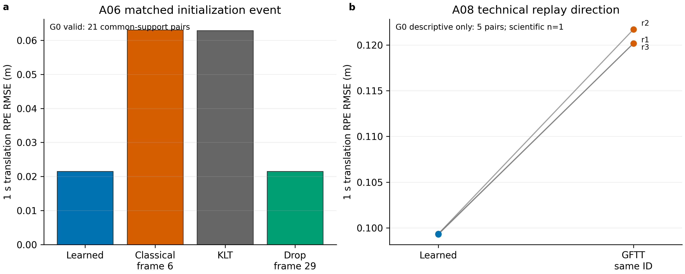

# Learned Specificity / Round 1 / Backend Value Audit / 2026-08-03

## 1. Executive Summary

本轮结论不是“Claude 全错”，也不是“learned 已经赢了”。准确判断如下：

1. Claude 对当前 QG、confirmatory low-texture superiority 和 persistent-anchor
   头条证据不足的批评有道理；这些 claim 仍不能写进论文。
2. Claude 将这些失败推广成“learned 对 SLAM 后端没有作用”或“经典方法已经
   击败 learned”没有证据支持。
3. A06 `2210-2700` 新 G0 评估达到有效 RPE 合同：learned 为
   `0.021522 m`，同帧经典替换为 `0.063065 m`，learned 低 `65.9%`。
4. A08 `4500-4660` 的同 ID、同槽位、同 10 观测剂量 GFTT+LK 控制消除了
   ID 排序混杂。三次技术回放中 learned RPE 均更低；G0 描述方向也一致，
   但该短窗只有 5 个严格 RPE 对，不能形成正式 metric claim。
5. A02 当前 LoFTR profile 和 NTNU 当前默认 same-pipeline probe 都是零动作，
   不能用来判定 learned 输赢。

因此，learned 研究线仍有论文价值，但只能支撑较窄的命题：

> 经保守准入的少量 learned gap-filling measurements，在特定退化初始化或短
> microburst 事件中，可以提供未被 matched classical replacement 复现的后端
> 有效几何。

这足以继续实验和保留论文方向，不足以按原计划宣称“learned/QG 在低纹理水下
SLAM 中普遍优于经典方法”。当前状态是 `CONTINUE, NOT SUBMISSION-READY`。

## 2. Experiment Identity and Decision Context

本轮要解决的决策不是“某个旧 APE 数字是否更好”，而是两个更严格的问题：

- learned measurement 是否对 VINS 后端产生可归因影响；
- 这种影响是否能被公平的 classical replacement 复现。

Claude 报告将旧 QG proxy、旧 selector contract、whole-lineage drop 和离线
Shi-Tomasi persistence 混合后，给出了 learned 主线应终止的总判断。本轮先审计
这些合同，再新增 matched classical 控制和 fresh serial replay。

所有本轮窗口均为 development-only。历史已看过 learned/VINS 结果的窗口不能
重新标成 held-out；当前 history manifest 中没有“已知 learned ID 且仍为 formal
held-out”的 42 s 以上窗口。

## 3. Setup and Evaluation Protocol

### 后端与回放

- Backend：`/home/ma/SLAM/VINS-Fusion-origin`。
- `multiple_thread=0`，同一 frozen VINS 配置，串行 ROS master。
- 三次 replay 只衡量 runtime repeatability，不作为三个独立样本。
- 主指标：1 s translation RPE RMSE，越低越好。
- G0：1 Hz common grid、SE(3) body-to-camera、所有 arm 共同支撑。

### A06 控制

- Window：AQUALOC A06 `2210-2700`，23.99 s。
- Learned：两个 learned/LoFTR 事件，共 10 个发布观测。
- Classical control：在 frame 6 用对应 KLT frame 替换 learned 初始化事件。
- Later-event control：只移除 frame-29 learned 事件。
- G0 support：22 common poses、21 RPE pairs、21 s span；`rpe_valid=true`，
  `ape_valid=false`。

### A08 控制

- Window：AQUALOC A08 `4500-4660`，8.00 s。
- Learned：IDs `421/422`，feature frames `2-6`，10 个观测。
- Classical：raw image 上 GFTT 检测、LK/FB 跟踪，完整区间存活后按 learned
  初始位置邻近匹配，距离 `8.50/7.45 px`。
- Final control：保留 IDs `421/422`、原 observation slots、q、sigma、frame
  counts、timestamps、IMU 和 GT；只替换目标 geometry、velocity 和 source flags。
- 该控制对 backend outcome blind，但使用完整区间存活和 learned 位置，是
  retrospective matched-attribution control，不是 online randomized C-QG。

## 4. Main Findings

### 4.1 A06 提供当前最强的 learned backend 证据

| Arm | G0 1 s RPE RMSE (m) | 相对 frame-6 classical |
| --- | ---: | ---: |
| Learned full | 0.021522 | 低 65.9% |
| Frame-6 classical replacement | 0.063065 | reference |
| KLT | 0.062888 | 近似 classical replacement |
| Frame-29 learned removal | 0.021522 | 与 learned 相同 |

这里的关键不是单独一个低数值，而是两个归因信号同时出现：frame-6 替换使结果
回到 KLT 水平，frame-29 删除保持不变。learned 对后端有作用，但作用定位在初始化
事件，不能解释成 persistent learned anchor。

### 4.2 A08 在排除 ID 排序混杂后仍为 learned-positive

| Replay | Learned legacy RPE | Same-ID GFTT RPE | Learned 降低 |
| --- | ---: | ---: | ---: |
| r1 | 0.113357 | 0.135988 | 16.6% |
| r2 | 0.113357 | 0.140069 | 19.1% |
| r3 | 0.113328 | 0.135987 | 16.7% |

三次 learned 均更低，arm-mean reduction 为 `17.5%`。G0 重算的 arm mean 为
`0.099330` versus `0.120675 m`，方向相同，降低 `17.7%`。但是 G0 只有 6 个
common poses 和 5 个 RPE pairs，明确 `rpe_valid=false`。A08 只能作为具体事件
的 geometry-attribution 证据。

### 4.3 零动作结果不能用于否定 learned

- A02 current LoFTR：200 帧、57 candidates、29 confirmed、0 exported。这里
  测到的是 adaptive mirror fallback，而不是 learned measurement 的后端质量。
- NTNU current-default same-pipeline：classical 和 fresh XFeat 均 0 admission、
  0 injection，两个输出 bag SHA256 完全相同。它说明当前默认脚本不能复现
  historical old-profile positive，不能说明 classical 或 learned 胜出。

### 4.4 Claude 报告中仍成立的负结论

- A09/A10 旧 APE 缺少足够 common support，不能作为 load-bearing evidence。
- 当前 QG probe 未使用冻结 pooled conformal `q_i^-`、F/H residual 或 canonical
  VINS replay；旧 QG 非零表不能验证当前 P03。
- Cave 说明当前 learned profile 不会自动救活 severe sparsity。
- 当前证据没有证明低纹理总体优势、persistent learned anchors 或 QG backend
  benefit。

### 4.5 Claude 报告中不能成立的总否定

- 当前 selector base=350 且 cap=350，五臂实际零选择；旧非零表不是当前合同。
- Shi-Tomasi `81%` versus learned `27%` 使用不同 trigger、birth、tracking、
  lifetime 和 exporter，不能推出 classical 已在相同 pipeline 击败 learned。
- Cave classical proxy 是 learned-lineage drop，不是独立 GFTT proposer。
- A06 和 A08 的 matched controls 已直接反证“learned 对后端没有作用”。

## 5. Statistical Validation

科学独立单位只有两个 development event：A06 和 A08。A08 的三次 replay 共享
同一 bag、GT 和窗口，不提供总体推断自由度。因此本轮没有运行 t-test、Wilcoxon、
总体置信区间或显著性检验，也没有把 `3/3` 写成 `n=3` 独立实验。

A06 的 RPE 支撑合同有效，可以报告该窗口的 event-level effect size `65.9%`；
不能据此给出 population-level superiority。A08 只能报告方向一致和 runtime SD，
不能把 legacy 的 57 pairs 或 strict 的 5 pairs 当独立样本。

完整统计口径见 `learned_specificity_20260803/analysis-output/stats-appendix.md`。

## 6. Figure-by-Figure Interpretation

### Figure 1

- Why this figure exists：将最强的有效 A06 归因结果与 A08 技术重复方向放在
  同一证据梯度中，避免把两者当成同等级结论。
- What to notice：A06 learned 和 frame-29 drop 明显低于 frame-6 classical/KLT；
  A08 每次 replay 都从 learned 向 GFTT 上升。
- Supported interpretation：learned geometry 在这两个 development event 中
  有 backend-relevant effect，且 A08 不是 feature-ID 排序伪影。
- Decision implication：保留 learned 分支；不将 A08 或技术 replay 误用为总体
  显著性证据。

## 7. Failure Cases, Negative Results, and Limitations

1. A08 严格 RPE 无效，legacy GT reference reuse 严重。
2. A08 classical matching 使用未来 full-interval survival 和 learned location，
   给 classical 一个 oracle-survival 优待，但仍不是在线 detector-isolation control。
3. A06/A08 均为历史筛过的 development positive，不是 held-out。
4. NTNU 当前默认 C-QG 脚本两臂均零动作，尚未补齐 historical profile 的公平
   same-pipeline learned/classical 对照。
5. A02 当前 profile 零动作，不能提供 learned efficacy 样本。
6. Cave 仍是实质负例：现 learned profile 没有救活 severe sparse regime。
7. P03/QG 仍缺 disjoint K0/L/E、pooled conformal `q_i^-`、F/H normalization、
   canonical bags 和 backend replay。

## 8. What Changed Our Belief

- Strengthened：learned measurement 对 VINS 后端“可能有特异几何价值”，不是
  单纯前端计数或 covariance 叙事。
- Weakened：persistent learned anchor、general low-texture superiority 和 QG
  headline 三个原假设。
- Rejected：learned 对后端完全无作用、已被 classical 普遍击败的 blanket claim。
- Unresolved：learned advantage 能否跨独立序列、held-out window 和当前冻结
  profile 复现。

`results-report` 的决策导向直接影响本报告：本轮没有把正向 development signal
升级为投稿结论，而是将它限定为继续投入下一轮实验的依据。

## 9. Next Actions

1. 先跑 A03 `5000-5900` development matched extension。其目标 learned lineage
   连续 29 帧，GFTT 最近替代约 `8.95 px`，预计可达到有效 G0 common support；
   这是当前最有判别力的下一格。
2. 再跑 A09 `3600-4500` post-init extension。它后端较稳定，但最近 GFTT 替代
   约 `36.4 px`，必须标为 post-init measurement specificity，而非 selector 验证。
3. 冻结方法后，用 KLT/image-quality-only 规则首次选择 formal held-out windows。
   任何已查看 learned outcome 的扩窗继续保留 development-only 标签。
4. 若两条 extension 和至少两个 held-out sequence 方向多数为正，可把论文定位为
   “gated learned gap-filling measurements with event-specific backend value”。
5. 若 matched extension 多数不正或 held-out 翻符号，停止 learned-superiority
   叙事，改写为 source-agnostic persistent/gap-filling frontend。
6. QG 若不补齐当前合同和 canonical replay，应从 headline 降为 future work 或
   development ablation，不能与 A06/A08 归因证据绑定陈述。

## 10. Artifact and Reproducibility Index

### Analysis bundle

- `learned_specificity_20260803/analysis-output/analysis-report.md`
- `learned_specificity_20260803/analysis-output/stats-appendix.md`
- `learned_specificity_20260803/analysis-output/figure-catalog.md`
- `learned_specificity_20260803/analysis-output/replay-metrics.csv`
- `learned_specificity_20260803/analysis-output/comparison-summary.csv`
- `learned_specificity_20260803/analysis-output/probe-summary.csv`

### A06

- `/mnt/data/AQUA-FE_WS/validation_20260803/a06_2700_common_support_matched/`
- `/mnt/data/AQUA-FE_WS/validation_20260802/a06_2700_classical_replace_frame6.bag`
- `/mnt/data/AQUA-FE_WS/validation_20260802/a06_2700_drop_frame29_only.bag`

### A08

- `/mnt/data/AQUA-FE_WS/validation_20260803/a08_4500_4660_gftt_preserve_id_control.bag`
- `/mnt/data/AQUA-FE_WS/validation_20260803/a08_4500_4660_gftt_preserve_id_control.json`
- `/mnt/data/AQUA-FE_WS/validation_20260803/a08_4500_4660_full_vs_gftt_preserve_id.md`
- `/mnt/data/AQUA-FE_WS/validation_20260803/a08_gftt_preserve_id_replay_r1/`
- `/mnt/data/AQUA-FE_WS/validation_20260803/a08_gftt_preserve_id_replay_r2/`
- `/mnt/data/AQUA-FE_WS/validation_20260803/a08_gftt_preserve_id_replay_r3/`
- `/mnt/data/AQUA-FE_WS/validation_20260803/a08_preserve_id_common_support/`

### Zero-action probes and scripts

- `/mnt/data/AQUA-FE_WS/validation_20260803/ntnu_cqg/`
- `/mnt/data/AQUA-FE_WS/logs/aqualoc_archaeo_vins/external_hybrid_superpoint_lightglue_every2_validation_20260803_a02_2800_3200_loftr/`
- `scripts/build_gftt_matched_lineage_control.py`
- `scripts/build_learned_specificity_analysis.py`

本工作区未绑定 Obsidian project KB，因此未执行 `Results/Reports/`、Daily note 或
project-memory 写回。

