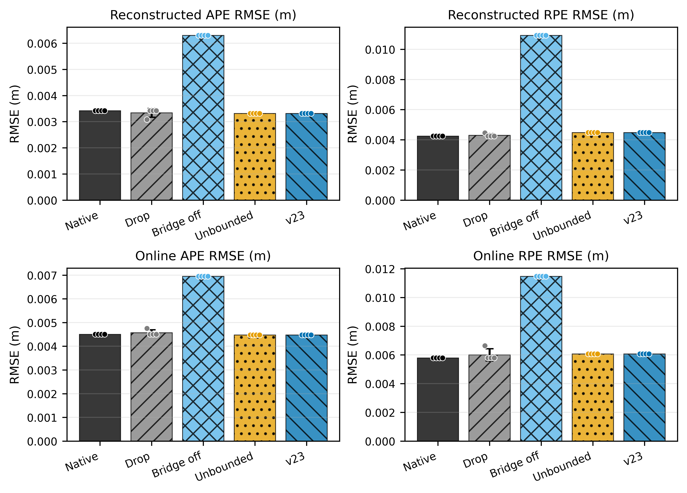
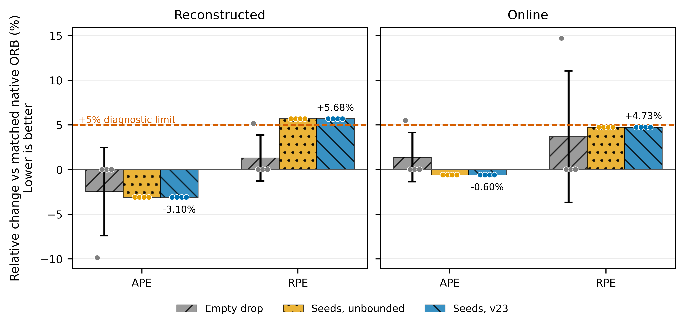
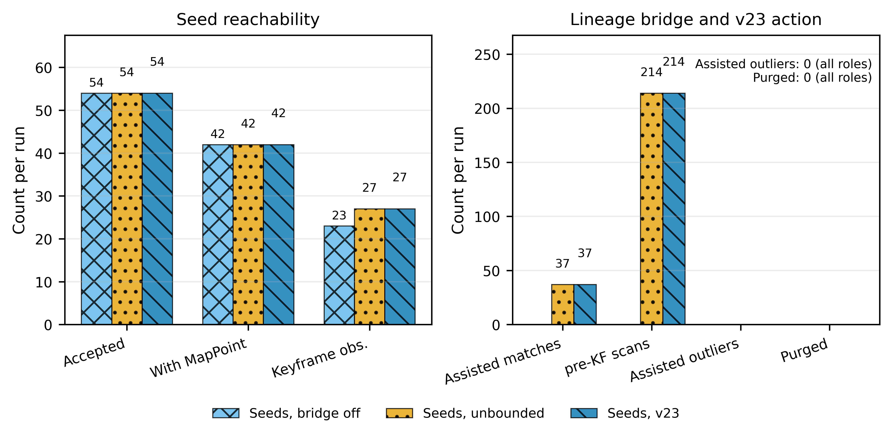

# ORB v23 Cross-Dataset / Round 01 / transfer-summary / 2026-07-31

> 当前仓库未绑定 Obsidian 项目知识库。本报告只写入本地 `papers/`，未执行 Obsidian write-back。

## 1. 执行摘要（Executive Summary）

本轮接续 NTNU `s30,d10` 的 pre-init reachability 负结果，将 A10 上冻结的 ORB-SLAM3 v23 原样迁移到 AFRL Cave Gennie `s0,d20`。候选使用 final-online selector 自然产生的单条 XFeat-to-KLT lineage，共 54 个 observations，全部位于 ORB 初始化之后；没有修改质量阈值、projection/descriptor gate、lineage 剂量或 v23 源码。

最高置信度结论分三层：

1. **post-init reachability 成立。** 四轮每个 seeded role 都接受 `54/54` observations；1 条 lineage 成为 MapPoint，42 个 accepted observations 与 MapPoint 关联。bridge-on 每轮实际消费 37 次 assisted matches。
2. **lineage bridge 有明确作用，但轨迹结果不是正例。** bridge-off 相对 native ORB 的 reconstructed APE/RPE 恶化 `84.074%/157.375%`，online APE/RPE 恶化 `54.148%/98.015%`。bridge-on 将轨迹拉回 native 附近，但 frozen v23 最终是 APE 略好、RPE 略差：reconstructed `-3.098%/+5.679%`，online `-0.599%/+4.730%`，不能写成双指标精度正例。
3. **v23 guard 仍未得到第二域 action 证据。** bridge-on 每轮执行 214 次 pre-KF scans，但 assisted outlier/purge 为 `0/0`。`full` 与 `full_unbounded` 在四轮、两类轨迹上 `8/8` 逐字节一致，因此本窗不能证明 purge 改善或保护了轨迹。

本轮改变的项目决策是：**AFRL 已经证明“post-init persistent-state reachability + bridge consumption”可以跨数据迁移，但也证明 reachability 本身不足以产生轨迹正例或 v23 action。停止重复该窗口，不调 frozen 参数；下一候选必须在 smoke 中自然出现 assisted outlier，才值得进入正式 v23 action 矩阵。**

## 2. 实验身份与决策背景（Experiment Identity and Decision Context）

### 2.1 前一轮留下的缺口

NTNU `fjord_4 s30,d10` 的正式 final-online lineage 含 8 个 observations，ORB 接受 8/8，但全部发生在原生 ORB 初始化之前，最终为：

- `seed_lineages_with_mappoint=0`；
- assisted matches `0`；
- pre-KF action `0/0`；
- online APE 相对 native 恶化 `12.324%`。

该结果锁定了 v23 guard 上游的状态可达性问题，但没有回答两个更进一步的问题：

- 如果 lineage 确实在 post-init 阶段成为 MapPoint，ORB 是否会实际消费 assisted matches？
- assisted path 一旦可达，冻结 v23 是否会遇到并清除 assisted outlier，从而形成第二数据域机制证据？

### 2.2 本轮的预注册判定

smoke 的 Go 条件是：

1. ORB 在第一条 seed 前完成初始化；
2. `seed_lineages_with_mappoint >= 1`；
3. `lineage_assisted_matches_consumed > 0`；
4. 若要宣称 v23 action，必须进一步观察 assisted outlier 与 purge。

AFRL Gennie 通过前 3 项，因此进入四轮五臂正式实验。第 4 项没有通过，所以最终只能建立 bridge reachability/consumption 证据，不能建立 v23 action-positive 证据。

## 3. 设置与评测协议（Setup and Evaluation Protocol）

### 3.1 数据与 seed 资产

| 项目 | 冻结值 |
| --- | ---: |
| Dataset | AFRL Cave Gennie `s0,d20` |
| 图像 | 389 张，1600 x 1200，原生约 20 Hz |
| 首末图像跨度 | `19.927276299 s` |
| GT | 60 个不规则 COLMAP poses |
| Seed | 1 lineage，54 observations，ID `10000000` |
| Seed 质量 | 全部 `0.920000017` |
| Seed 相对首图范围 | `14.058514200-19.479276099 s` |
| Seed 时间匹配 | 54/54 精确命中原生图像，最大误差 `0 ns` |

389 张 PNG 与 `cam0_times.txt` 一一对应，均为 mono8。相机 pinhole+radtan 参数逐值匹配 AFRL 官方 `camchain_cave_gennie.yaml`。原 feature bag 最后一条非 learned message 已被裁掉；所有 learned observations 均保留。

### 3.2 冻结 v23 合同

- ORB binary：`cebeeedb862a469f9b4928fc0712fd0fd93766d4a4b5faa09e7de5a0f19083fc`；
- ORB library：`05a7b3cc8aa7aaefec38ce995de9fbf808662c051f1ce1f0f35925f2e6093af8`；
- runner：`6ffedc001ae51b6b80a391c4dad3a6cbd917037968a1e94e582f98e78a4c4c77`；
- minimum quality：`0.9`；
- maximum projection error：`4 px`；
- maximum descriptor distance：`100`；
- culling grace、assisted dose cap、native-birth、quarantine：关闭；
- pre-KF assisted-outlier purge：开启且 enforce；
- CPU2、LocalMapping/LoopClosing 双 barrier、deterministic background gate、ASLR 关闭；
- online trajectory export：开启；
- instrumentation capacity：`131072`。

### 3.3 五臂与重复

| Role | Seed | Bridge | pre-KF scan | purge enforce | 目的 |
| --- | --- | --- | --- | --- | --- |
| `orb_only` | 无 | 开 | 关 | 关 | 稳定 native 控制 |
| `drop` | 空文件 | 开 | 关 | 关 | exact empty-seed 控制 |
| `full_bridge_off` | 54 | 关 | 关 | 关 | seed-only 路径 |
| `full_unbounded` | 54 | 开 | 开 | 关 | bridge-on、purge shadow |
| `full` | 54 | 开 | 开 | 开 | frozen v23 candidate |

共运行四轮。r1-r3 顺序为 `orb_only -> drop -> full_bridge_off -> full_unbounded -> full`；r4 交换最后两臂为 `... -> full -> full_unbounded`。

### 3.4 指标与 GT 边界

- APE：Sim(3)-aligned translational RMSE，越低越好；
- RPE：20-associated-pose translational RMSE，越低越好；
- 同时评估关机后 reconstructed 与运行时 online trajectory；
- `max_time_diff=0.06 s`；
- 343 个 ORB poses 中有 50 个与 60 个 GT poses 关联；
- 20-associated-pose RPE 的实际时间跨度为 `2.536-8.792 s`，中位数 `5.019 s`。

因此本文只使用“20-associated-pose RPE”，不把它写成 1 秒 RPE 或 20 图像帧 RPE。

## 4. 主要发现（Main Findings）

### 4.1 reachability 与 bridge consumption 四轮稳定

三个 seeded roles 都有：

- attempted/accepted `54/54`；
- pre-init attempted `0`，post-init accepted `54`；
- 1 条 lineage 成为 MapPoint；
- 42 个 accepted observations 与 MapPoint 关联；
- instrumentation complete，conservation valid，overflow `0/0`。

bridge-off 每轮有 23 个 keyframe observations；bridge-on 为 27 个，并消费 37 次 assisted matches。这说明 AFRL 候选不是“被 loader 接受但没进入后端”的假可达，而是真正参与了 ORB tracking/map lifecycle。

### 4.2 五臂轨迹结果

正相对百分比表示误差更高，负值表示误差更低。

| Trajectory | Role | APE mean +/- SD (m) | RPE mean +/- SD (m) | APE vs native | RPE vs native |
| --- | --- | ---: | ---: | ---: | ---: |
| Reconstructed | Native ORB | `0.003422 +/- 0.000000` | `0.004244 +/- 0.000000` | `0.000%` | `0.000%` |
| Reconstructed | Empty drop | `0.003338 +/- 0.000169` | `0.004299 +/- 0.000110` | `-2.469%` | `+1.290%` |
| Reconstructed | Seeds, bridge off | `0.006299 +/- 0.000000` | `0.010923 +/- 0.000000` | `+84.074%` | `+157.375%` |
| Reconstructed | Seeds, unbounded | `0.003316 +/- 0.000000` | `0.004485 +/- 0.000000` | `-3.098%` | `+5.679%` |
| Reconstructed | Seeds, v23 | `0.003316 +/- 0.000000` | `0.004485 +/- 0.000000` | `-3.098%` | `+5.679%` |
| Online | Native ORB | `0.004508 +/- 0.000000` | `0.005793 +/- 0.000000` | `0.000%` | `0.000%` |
| Online | Empty drop | `0.004570 +/- 0.000124` | `0.006006 +/- 0.000425` | `+1.375%` | `+3.673%` |
| Online | Seeds, bridge off | `0.006949 +/- 0.000000` | `0.011471 +/- 0.000000` | `+54.148%` | `+98.015%` |
| Online | Seeds, unbounded | `0.004481 +/- 0.000000` | `0.006067 +/- 0.000000` | `-0.599%` | `+4.730%` |
| Online | Seeds, v23 | `0.004481 +/- 0.000000` | `0.006067 +/- 0.000000` | `-0.599%` | `+4.730%` |

bridge-on 确实消除了 bridge-off 的大幅退化，但 frozen v23 并没有得到双指标胜利。reconstructed RPE 超过 `+5%` 诊断边界 `0.679` 个百分点；online RPE 位于边界内，但仍是恶化。

### 4.3 v23 purge 在本窗严格为零作用

`full_unbounded` 与 `full` 每轮都记录：

- assisted matches consumed：`37`；
- pre-KF scans：`214`；
- assisted outliers observed：`0`；
- pre-KF assisted outliers observed/purged：`0/0`。

两者四轮 reconstructed/online 文件分别逐字节相同，共 `8/8` same-repeat parity。purge enforce 没有改变事件流或轨迹，因此任何“v23 在 AFRL 改善/保护了轨迹”的说法都不成立。

### 4.4 empty-drop r1 是残余关键帧分叉

native 四轮轨迹逐字节一致，关键帧计数均为 56。drop r2-r4 与 native 的 reconstructed/online 逐字节一致，关键帧同为 56；只有 drop r1 生成了 57 个关键帧并产生不同轨迹。

drop r1 仍然加载 0 个 observations，manifest 中 binary/library/runner、CPU、barrier、gate、ASLR 和所有 lineage 参数与其他控制一致。因此它应被解释为 residual keyframe-insertion bifurcation，而不是 learned seed action，也不是空 seed 文件的系统性影响。该行保留在 mean/SD 中，不作剔除。

## 5. 统计验证（Statistical Validation）

独立证据单位是一个固定 AFRL 窗口，`n=1 window`。四轮只用于验证 runtime branch reproducibility，不是四个独立数据样本。因此：

- 不执行 t-test、Wilcoxon、Friedman 或人口层面显著性检验；
- 不报告误导性的置信区间或标准化人口效应量；
- 表中 mean +/- sample SD 只描述重复分支稳定性；
- 主要效应量是同一窗口、同一轮相对 native 的未标准化百分比变化；
- 不需要多重比较校正，因为没有实施推断检验。

native、bridge-off、unbounded、v23 各自在四轮内只有 1 个 trajectory hash；drop 有 2 个 hash，原因是 r1 的 57-keyframe 分叉。20/20 runs 均 `status=ok`，轨迹非空，审计完整，无 overflow。

当前证据支持“AFRL post-init lineage 可达并被 bridge 消费”和“bridge-off/bridge-on 在本窗产生大差异”；不支持跨窗口人口推断，也不支持 v23 purge 泛化。

## 6. 图表逐项解释（Figure-by-Figure Interpretation）

### Figure 1：五臂绝对 APE/RPE

- **为什么需要这张图：** 从零起点同时展示 reconstructed/online 的完整五臂误差，避免相对百分比掩盖绝对量级。
- **应观察什么：** bridge-off 在四个 panel 中都显著高于 native；unbounded 与 v23 重合并回到 native 附近。
- **支持的解释：** persistent lineage assistance 改变了 seed-only 的有害路径；但近 native 不等于双指标胜利。
- **决策影响：** 保留 bridge 作为 ORB observation-contract 的必要组件，不把本窗列入精度正例表。

### Figure 2：近基线相对变化与 5% 边界

- **为什么需要这张图：** bridge-off 的大误差会压缩 full/native 的小差异，因此单独放大 drop、unbounded、v23 的近基线变化。
- **应观察什么：** v23 reconstructed/online APE 分别为 `-3.10%/-0.60%`，RPE 为 `+5.68%/+4.73%`；reconstructed RPE 越过 5% 线。
- **支持的解释：** AFRL transfer 是 APE/RPE 混合结果，不是 dual-metric positive；drop r1 的单点分叉被完整显示。
- **决策影响：** 不能用 online APE 或 reconstructed APE 的单项改善选择性宣布成功。

### Figure 3：reachability、bridge consumption 与 v23 action

- **为什么需要这张图：** 把 loader acceptance、MapPoint reachability、assisted consumption 和 guard action 分成四个不同层级。
- **应观察什么：** 三个 seeded roles 均为 54 accepted、42 with MapPoint；bridge-on 有 37 assisted matches 和 214 scans，但 outlier/purge 为 0。
- **支持的解释：** bridge 已激活，v23 guard 仍休眠。scan count 只是机会检查，不是 intervention 证据。
- **决策影响：** 下一候选的准入条件必须从“有 MapPoint”进一步提高到“自然出现 assisted outlier”。

## 7. 失败、负结果与限制（Failure Cases / Negative Results / Limitations）

1. **轨迹精度正例失败。** frozen v23 的 APE 略低、RPE 略高，reconstructed RPE 超过 5% 诊断边界。
2. **v23 action-positive 失败。** 214 次 scans 没有遇到 assisted outlier，full/unbounded 精确相同。
3. **GT 稀疏且不规则。** 只关联 50 个 poses；20-pose RPE 的实际跨度变化很大，不能与规则 20 Hz 的 1 秒 RPE直接等同。
4. **外部效度仍是单窗。** AFRL 结果不能证明 bridge 在全部 AFRL/其他数据集普遍有益。
5. **bridge-off 机制仍是组合效应。** 该消融证明 persistent assistance 对本窗重要，但没有单独分解所有 KeyFrame/MapPoint lifecycle 内部原因。
6. **残余运行分叉未完全消除。** drop r1 的额外关键帧说明单 CPU、双 barrier、background gate 和 no-ASLR 仍不能保证所有空控制逐轮唯一。
7. **ORB 不消费 learned descriptor 或连续 q 权重。** seed 只提供位置/identity/quality gate，ORB descriptor 仍在本地重算。

## 8. 哪些证据改变了我们的判断（What Changed Our Belief）

### ER-20260731-afrl-gennie-v23-01

- Source type: experiment artifact + strict analysis bundle
- Supports: frozen final-online lineage 在 AFRL post-init 阶段形成 MapPoint，并被 ORB lineage bridge 消费
- Limitation: 单窗口、稀疏 GT、零 assisted outlier/purge
- Claim strength: supported（reachability/bridge）；negative boundary（v23 action/accuracy）
- Allowed wording: “冻结 lineage 在 AFRL 中进入 ORB 持久状态并参与 tracking；bridge-on 避免了本窗 seed-only 路径的大幅退化。”
- Forbidden wording: “v23 已在 AFRL 改善精度”或“purge 已跨数据泛化”。

本轮强化了两点：

1. NTNU 暴露的 post-init MapPoint reachability 确实是必要条件。AFRL 满足后，assisted matches 从 0 增加到 37，说明此前诊断方向正确。
2. 必要条件不是充分条件。即使 lineage 可达且 bridge 活跃，也可能没有 assisted outlier，最终 APE/RPE 仍然混合。

本轮削弱了一个隐含预期：只要把 seed 推迟到 ORB 初始化后，就会自然复现 A10 的 v23 action。现在更精确的机制链是：

> post-init birth -> MapPoint reachability -> assisted consumption -> assisted outlier opportunity -> pre-KF purge -> trajectory effect

AFRL 只闭合到第三步，A10 才闭合完整链条。

## 9. 下一步行动（Next Actions）

### 9.1 立即停止

- 停止重复 AFRL Gennie `s0,d20`；四轮已稳定回答 reachability、bridge 与 purge-null；
- 停止在本窗调整 q、projection、descriptor、dose、grace 或 purge 规则；
- 停止把 bridge-on 的 APE 小改善归因于 v23；
- 停止把 20-associated-pose RPE 写成 1 秒 RPE。

### 9.2 保留并进入项目证据

- 保留 AFRL 作为第一个正式 post-init MapPoint/assisted-consumption 跨数据证据；
- 保留 bridge-off 大幅退化与 bridge-on rescue 作为 observation-contract 消融；
- 保留 v23 `0/0` action 和 full/unbounded exact parity 作为真实负结果；
- 与 NTNU normal exact no-harm、NTNU low pre-init null、A10 v23 action-positive 一起组成 ORB 边界链。

### 9.3 下一低纹理候选的准入条件

下一候选仍使用完全冻结的 final-online/v23 合同，并按以下顺序筛选：

1. selector 不依赖默认关闭的数据集专用开关；
2. observations 位于 ORB 初始化后；
3. smoke 中 `seed_lineages_with_mappoint >= 1`；
4. `lineage_assisted_matches_consumed > 0`；
5. `lineage_pre_kf_assisted_outliers_observed > 0` 后才进入正式 v23 action 矩阵；
6. 轨迹指标只用于最终评估，不反向调 selector 或 guard。

如果继续找不到第 5 项，应把论文结论冻结为“A10 单窗 action-positive + NTNU/AFRL 跨域 reachability 边界”，而不是扩大 dose 制造 action。

### 9.4 正常纹理 no-harm

NTNU `s50,d20` 已提供 12 arms reconstructed/online 逐字节一致的正常纹理 exact no-harm。当前不需要为了 AFRL 低纹理结果重新打开 selector 或 v23 参数；若增加第三域正常窗，应作为固定配置的独立复现，而不是本轮失败补救。

## 10. 资产与可复现性索引（Artifact and Reproducibility Index）

### 10.1 严格分析 bundle

- `analysis-output/analysis-report.md`
- `analysis-output/stats-appendix.md`
- `analysis-output/figure-catalog.md`
- `analysis-output/case_summary.csv`
- `analysis-output/paired_effects.csv`
- `analysis-output/role_summary.csv`
- `analysis-output/provenance.json`
- `analysis-output/figures/figure-01-five-arm-absolute-metrics.pdf`
- `analysis-output/figures/figure-02-near-baseline-relative-change.pdf`
- `analysis-output/figures/figure-03-reachability-and-action-counts.pdf`

分析脚本在创建输出目录前验证 20 臂笛卡尔积、evaluation status、instrumentation conservation/overflow、全部 run manifests、冻结 source/runtime snapshots、CSV/metric-report 一致性、trajectory/GT association 和 role-order swap。13 个 bundle 文件在独立目录重建后逐字节一致。

### 10.2 原始运行与资产

- 正式五臂四轮：`/mnt/data/AQUA-FE_WS/orbslam3_seeded_validation/postinit_search_20260731/afrl_gennie_s0_d20/formal_finalonline_v23_lineagefirst_lateenforce_dualgateack_equalruntime_singlecpu2_noaslr_fivearm_h100_q09`
- reachability smoke：`/mnt/data/AQUA-FE_WS/orbslam3_seeded_validation/postinit_search_20260731/afrl_gennie_s0_d20/smoke_finalonline_v23_lineagefirst_lateenforce_dualgateack_equalruntime_singlecpu2_noaslr_threearm_h100_q09`
- dataset：`/mnt/data/AQUA-FE_WS/orbslam3_validation/afrl_gennie_s0_d20/dataset`
- seed assets：`/mnt/data/AQUA-FE_WS/orbslam3_seeded_validation/postinit_search_20260731/afrl_gennie_s0_d20/assets`
- camera config：`/home/ma/AQUA-FE_WS/logs/orbslam3_validation/afrl_gennie_cam0_mono.yaml`

### 10.3 代码

- `/home/ma/AQUA-FE_WS/scripts/analyze_orbslam3_v23_afrl_gennie.py`
- `/home/ma/AQUA-FE_WS/scripts/run_orbslam3_seeded_triplet.sh`
- `/home/ma/AQUA-FE_WS/scripts/evaluate_orbslam3_seeded_runs.py`
- ORB source：`/home/ma/SLAM/orb_slam3_lineage_ws/src/ORB_SLAM3-lineage`

## 最终决策

**AFRL Gennie 已经把 ORB 跨数据问题从“seed 能否进入持久状态”推进到“assisted path 是否产生 outlier opportunity”。本轮支持 post-init reachability 和 lineage bridge consumption，支持 bridge-on 对 seed-only 大幅退化的受控缓解；不支持轨迹精度正例，也不支持 v23 purge 跨数据泛化。该窗口停止，下一步只寻找 frozen contract 下自然产生 assisted outlier 的独立候选。**
