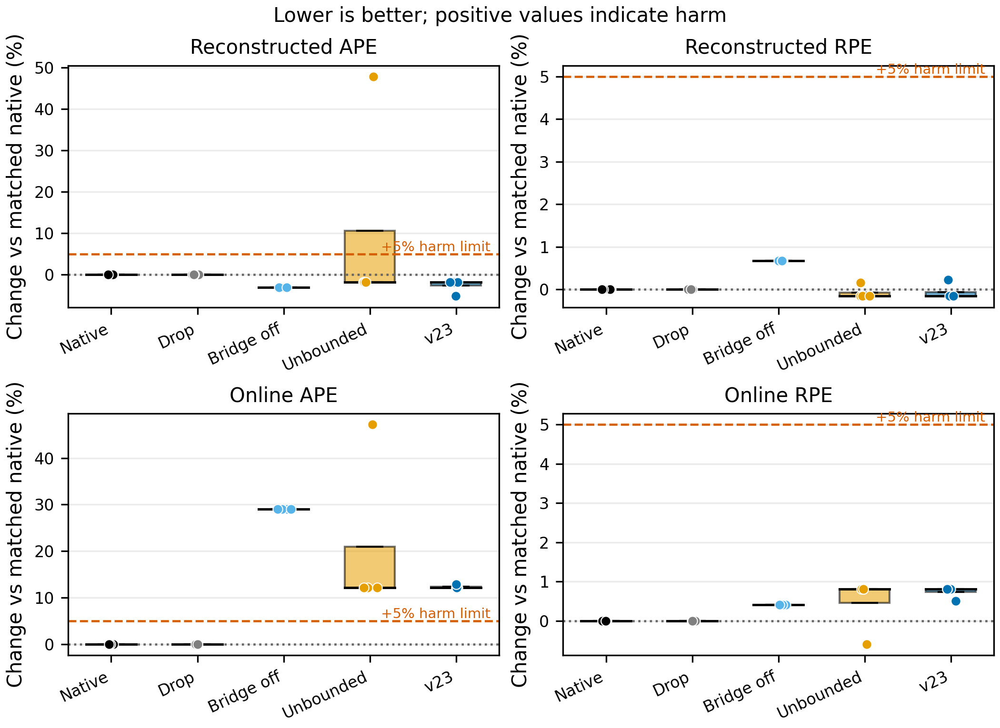
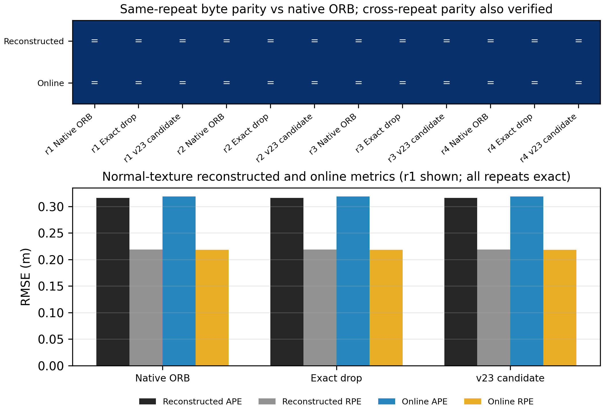

# ORB v23 Cross-Dataset / Round 00 / transfer-summary / 2026-07-30

> `r00` 是当前实验线尚未定义语义化轮次时的临时编号。当前仓库未绑定 Obsidian 项目知识库，因此本报告只写入本地 `papers/`，未执行 Obsidian write-back。

## 1. 执行摘要（Executive Summary）

本轮把在 AQUALOC A10 `2400-2800` 上冻结的 ORB-SLAM3 v23 原样迁移到独立的 NTNU `fjord_4`。评测包含一个低纹理 final-online 窗口 `s30,d10` 和一个不重叠的正常纹理 no-harm 窗口 `s50,d20`，没有修改 v23 源码、质量阈值、descriptor/projection gate 或 lineage 剂量。

最高置信度结论有两条：

1. **正常纹理 exact no-harm 成立。** `s50,d20` 的 12 个 arms（4 轮 x 3 roles）在 reconstructed 与 online 两类轨迹上分别逐字节一致；199/200 前端帧为 `healthy`，learned 注入为 0。该结果可以作为“冻结 causal fallback 在一个独立正常纹理 NTNU 窗口上不改变 ORB 输出”的受控证据。
2. **低纹理跨数据 v23 正例不成立。** `s30,d10` 的一条 final-online lineage 含 8 个 observations，ORB 在 seeded arms 中接受 8/8，但没有形成 MapPoint、assisted match 或 pre-KF purge。v23 candidate 的 online APE 相对 native 平均恶化 `12.324%`，四指标 5% no-harm 为 `0/4`。这是冻结迁移负结果，不是 v23 action 的失败或成功证明。

独立的历史 `n6,d20` 高剂量诊断确实触发了 `1` 次 pre-KF purge，说明 v23 在 NTNU 可以执行机制动作；但其事件流在 purge 前已经分叉，且轨迹指标混合，因此不能替代正式 final-online 结果。

本轮改变的项目决策是：**正常纹理 no-harm 子任务已闭合；停止在 NTNU `s30,d10` 上调 v23 或增加剂量。下一低纹理迁移必须先找到“ORB 初始化后形成持久 MapPoint”的冻结 final-online lineage，再检验 v23 guard。**

## 2. 实验身份与决策背景（Experiment Identity and Decision Context）

### 2.1 先验结果

A10 `2400-2800` 上的 v23 候选相对 native ORB 同时改善 reconstructed 与 online APE/RPE：

| 角色 | Reconstructed APE/RPE | Online APE/RPE |
| --- | ---: | ---: |
| Native ORB | `0.014089/0.017840` | `0.029865/0.034533` |
| v23 candidate | `0.011993/0.016178` | `0.023529/0.019948` |

该窗有 `52` 次 assisted matches、`15` 个 assisted optimizer outliers，以及 pre-KF `13/13` 精确清除，因此 A10 支持的是一个明确机制链：已知 assisted outlier 在 KeyFrame 创建前被阻断，避免其进入持久地图。

### 2.2 本轮要解决的两个问题

- 在不重新调参的条件下，A10 v23 是否能作用于独立 NTNU 低纹理 final-online lineage，并得到四指标可接受的外推？
- 当正常纹理 selector 不接纳 learned lineage 时，完整 runtime path 是否保持 native ORB 输出不变？

这两个问题必须分开。低纹理外推要求存在实际作用对象；正常纹理 no-harm 则专门检查零注入 fallback 与 guard 扫描是否扰动 native 路径。

## 3. 设置与评测协议（Setup and Evaluation Protocol）

### 3.1 数据与窗口

| 窗口 | 用途 | 输入帧 | 频率 | 主要前端状态 |
| --- | --- | ---: | ---: | --- |
| NTNU fjord_4 `s30,d10` | 低纹理 final-online 外推 | 199 | 20 Hz | 1 lineage / 8 observations |
| NTNU fjord_4 `s50,d20` | 正常纹理 no-harm | 399 | 20 Hz | 199/200 healthy，0 注入 |

两个窗口不重叠，使用相同 NTNU 单目配置和各自 native `cam0_times.txt`。RPE delta 固定为 20 帧。

### 3.2 冻结 v23 合同

- lineage bridge：开启，lineage-first；
- minimum quality：`0.9`；
- maximum projection error：`4 px`；
- maximum descriptor distance：`100`；
- culling grace：`0`；
- assisted-match lifetime cap：关闭；
- MapPoint/terminal quarantine：关闭；
- pre-KF assisted-outlier purge：开启且 enforce；
- CPU：单 `CPU2`；
- LocalMapping / LoopClosing 双 barrier；
- deterministic background gate；
- ASLR 关闭；
- online trajectory export 开启；
- instrumentation event capacity：`131072`。

### 3.3 对照与重复

低纹理使用五个 roles：`orb_only`、`drop`、`full_bridge_off`、`full_unbounded`、`full`。正常纹理使用三个 roles：`orb_only`、`drop`、`full`。

两组各运行四轮。低纹理 r4 交换 `full` 与 `full_unbounded` 顺序；正常纹理 r4 交换 `full` 与 `drop` 顺序。该设计检查 batch position / role order 对 ORB 地图分支的影响。

### 3.4 验收规则

- 主指标：SE(3) 对齐 APE RMSE，越低越好；
- 次指标：固定帧差平移 RPE RMSE，越低越好；
- 同时评估关机后 reconstructed trajectory 和运行时 online trajectory；
- no-harm：candidate 相对 native 的四项指标均不得恶化超过 5%；
- exact no-harm：轨迹文件逐字节一致，强于数值阈值判定；
- 机制正例：必须有 assisted match 和 pre-KF action，不能把零动作分支写成 v23 因果收益。

## 4. 主要发现（Main Findings）

### 4.1 低纹理 final-online 没有形成 v23 的作用对象

正式 selector 导出 1 条 lineage、8 个 observations。所有 seeded arms 都接受 8/8，但 `seed_lineages_with_mappoint=0`、assisted matches 为 0、pre-KF assisted outlier/purge 为 `0/0`。

| 角色/分支 | Reconstructed APE/RPE | Online APE/RPE | 解释 |
| --- | ---: | ---: | --- |
| Native ORB（r1-r4） | `0.017459/0.239246` | `0.029706/0.232416` | 四轮字节一致 |
| Exact drop（r1-r4） | `0.017459/0.239246` | `0.029706/0.232416` | 与 native 字节一致 |
| Bridge off（r1-r4） | `0.016923/0.240853` | `0.038326/0.233360` | seed 添加本身改变自然分支 |
| Unbounded dominant（r1/r3/r4） | `0.017143/0.238865` | `0.033311/0.234293` | 零 assisted action |
| Unbounded alternate（r2） | `0.025814/0.239622` | `0.043731/0.231031` | 自然 alternate map branch |
| v23 dominant（r1-r3） | `0.017143/0.238865` | `0.033311/0.234293` | 与 unbounded dominant 相同 |
| v23 role-swap（r4） | `0.016554/0.239783` | `0.033535/0.233595` | 零 guard action下的另一分支 |

v23 四轮均值相对 native 的变化为：

| 指标 | Native mean +/- SD | v23 mean +/- SD | 相对改善，正值为好 |
| --- | ---: | ---: | ---: |
| Reconstructed APE | `0.017459 +/- 0.000000` | `0.016996 +/- 0.000294` | `+2.653%` |
| Reconstructed RPE | `0.239246 +/- 0.000000` | `0.239094 +/- 0.000459` | `+0.063%` |
| Online APE | `0.029706 +/- 0.000000` | `0.033367 +/- 0.000112` | `-12.324%` |
| Online RPE | `0.232416 +/- 0.000000` | `0.234119 +/- 0.000349` | `-0.733%` |

四轮都因 online APE 超过 5% 恶化阈值而失败，因此 no-harm 是 `0/4`。reconstructed APE 的小幅改善不能覆盖 online 失败，也不能归因于从未执行的 purge。

### 4.2 正常纹理 exact no-harm 已闭合

正常纹理 selector 日志有 200 帧，其中 199 帧 trigger reason 为 `healthy`，base grid coverage 中位数为 `0.9444`，selector 注入和导出 seeds 都为 0。

四轮、三个 roles 共 12 arms 均有：

- `390/399` poses，coverage `0.9774436090`；
- reconstructed `0.316160/0.218529`；
- online `0.318803/0.218009`；
- reset `0`，relocalization `0`；
- instrumentation complete，conservation valid；
- event / related MapPoint overflow `0/0`；
- candidate 每轮执行 240 次 pre-KF scan，所有 learned/action counters 为 0。

每一种 reconstructed 轨迹在 12 arms 内共享同一个 SHA-256；online 轨迹同样如此。r4 的 role-order swap 没有破坏一致性。这不是“误差足够接近”，而是同一类型输出逐字节相同。

### 4.3 高剂量诊断只证明机制可触发

历史 `n6,d20` 资产包含 6 条 lineages、144 observations，只用于机制诊断：

| 角色 | Reconstructed APE/RPE | Online APE/RPE | Assisted matches | Assisted outliers | Pre-KF purge |
| --- | ---: | ---: | ---: | ---: | ---: |
| Native | `0.015576/0.239768` | `0.028814/0.232660` | 0 | 0 | 0 |
| Unbounded | `0.025914/0.237747` | `0.038184/0.231176` | 19 | 1 | 0 |
| v23 | `0.023451/0.238427` | `0.033644/0.234253` | 15 | 3 | 1 |

候选相对 unbounded 改善 reconstructed APE，但恶化 reconstructed RPE；相对 native 的 reconstructed/online APE 仍更差。更关键的是，事件流从 event index 500 起已不同，而 candidate 的第一个 assisted-outlier event 到 index 531 才出现，因此不存在 same-prefix 因果对照。唯一允许的结论是：v23 能在 NTNU 遇到并清除 assisted outlier，当前诊断不能证明这次清除改善轨迹。

## 5. 统计验证（Statistical Validation）

统计单位是固定窗口内的运行时重复，不是四个独立数据样本。每个纹理条件只有一个 NTNU 窗口，因此：

- 不执行 t-test、Wilcoxon、Friedman 或人口层面的显著性检验；
- 不把四轮地图分支当作独立抽样；
- 不报告会误导的标准化人口效应量或置信区间；
- 低纹理只报告逐轮值、mean +/- sample SD、四指标相对变化和 no-harm 通过数；
- 正常纹理使用轨迹 SHA-256 exact equality 作为主要复现证据。

低纹理 candidate 的 SD 反映 r4 role-order 下的另一自然地图分支，不表示总体均值估计的不确定性。正常纹理的所有差值为精确零，均值/SD、置信区间或零假设检验不会增加信息。

当前证据强度边界是：正常纹理 exact no-harm 对该窗口为 supported；低纹理迁移失败对该 frozen lineage 为 supported；“v23 在 NTNU 普遍无效”不受支持；“v23 已跨数据因果泛化”同样不受支持。

## 6. 图表逐项解释（Figure-by-Figure Interpretation）

### Figure 1：低纹理四指标对照

- **为什么需要这张图：** ORB 的 reconstructed 与 online 轨迹可能给出不同结论，必须把四个指标相对同轮 native 的变化、`+5%` no-harm 边界和 alternate branches 同时展示。
- **应观察什么：** v23 reconstructed APE 位于 native 附近且略低，但 online APE 全部高于 native；unbounded r2 出现明显 alternate branch，v23 r4 也受 role order 影响。
- **支持的解释：** 零 assisted/purge action 下的差异是 ORB 自然分支与 seeded execution path 差异，不能归因于 v23 guard。
- **决策影响：** `s30,d10` 不进入跨数据正例表，也不继续用于 v23 阈值或剂量调参。

### Figure 2：正常纹理 exact no-harm

- **为什么需要这张图：** 数值表只能说明指标相同，哈希矩阵进一步验证 reconstructed/online 文件在 roles 和重复间完全相同。
- **应观察什么：** 24 个 same-repeat equality cells 全部通过，另行计算的 cross-repeat equality 也通过；三种角色的 reconstructed/online APE/RPE 柱完全相同。
- **支持的解释：** 当 causal frontend 不接纳 lineage 时，冻结 selector、bridge runtime 和 240 次 pre-KF scan 没有改变该窗口的 ORB 输出。
- **决策影响：** NTNU 正常纹理 no-harm 子任务可以关闭，并作为后续论文/总表中的受控安全证据。

## 7. 失败、负结果与限制（Failure Cases / Negative Results / Limitations）

1. **低纹理 formal transfer 是负结果。** online APE 恶化 `12.324%`，no-harm `0/4`；任何只引用 reconstructed APE 的写法都属于选择性报告。
2. **正式 lineage 太早。** 8 个 seed observations 位于约 `1.0-1.7 s`，早于原生 ORB 约 `3.65 s` 的首次输出；它们没有成为持久 MapPoint，v23 没有可调节的 commit 对象。
3. **高剂量不等于正式方法。** `n6,d20` 使用历史 6-lineage 资产，不能替代 final-online 单 lineage 合同。
4. **ORB 地图分支仍对执行顺序敏感。** unbounded r2 与 candidate r4 的 alternate branch 表明确定性 harness 降低但没有消除所有 batch-position 分支。
5. **正常纹理 no-harm 是零注入条件下的强 null-path 证据。** 它不证明“有 learned action 时也普遍无害”。
6. **外部效度仍只有一个 NTNU 正常窗和一个低纹理 formal 窗。** 不能从单窗推导全数据集或所有相机模型结论。
7. **统计推断受限。** 四轮重复用于复现和顺序审计，不提供跨窗口人口推断。

## 8. 哪些证据改变了我们的判断（What Changed Our Belief）

### ER-20260730-ntnu-orb-noharm-01

- Source type: experiment artifact + strict analysis bundle
- Supports: frozen causal fallback 在 NTNU 正常纹理 `s50,d20` 上 exact no-harm
- Limitation: 单窗口、零 learned injection
- Claim strength: supported
- Allowed wording: “在一个不重叠的正常纹理 NTNU 窗口上，冻结系统跨四轮保持 native ORB reconstructed/online 输出逐字节一致。”
- Forbidden wording: “v23 对所有正常场景普遍无害。”

### ER-20260730-ntnu-orb-lowtexture-01

- Source type: experiment artifact + strict analysis bundle
- Supports: frozen final-online lineage 没有在 NTNU `s30,d10` 形成 ORB 持久状态，且四指标 no-harm 失败
- Limitation: 单条 pre-init lineage，不能代表所有 NTNU 低纹理窗口
- Claim strength: supported boundary/negative evidence
- Allowed wording: “该冻结 final-online lineage 没有迁移成 ORB 正例，瓶颈位于 v23 guard 上游。”
- Forbidden wording: “v23 在 NTNU 无效”或“learned geometry 在 NTNU 无价值。”

### ER-20260730-ntnu-orb-diagnostic-01

- Source type: diagnostic experiment artifact
- Supports: v23 能在 NTNU 实际执行 pre-KF assisted-outlier purge
- Limitation: 历史高剂量、多 lineage、单轮、purge 前已分叉、轨迹结果混合
- Claim strength: observed
- Allowed wording: “NTNU 诊断中观察到一次 purge action。”
- Forbidden wording: “v23 的轨迹收益已跨数据因果成立。”

这三条记录共同改变了原先“只要换一个低纹理数据集就能直接复现 A10 action”的预期。当前更精确的认识是：**guard 泛化之前，必须先满足后端状态可达性。final-online lineage 只有在 ORB 初始化后形成可持续 MapPoint，pre-KF commit guard 才有可调节对象。**

## 9. 下一步行动（Next Actions）

### 9.1 立即停止

- 停止在 NTNU `s30,d10` 上调整 `q`、projection、descriptor、dose、grace 或 purge 规则；
- 停止把 diagnostic `n6,d20` 提升为正式跨域结果；
- 停止只看 reconstructed trajectory；继续保持四指标联合验收；
- 停止把 ORB 运行时重复当作独立统计样本。

### 9.2 保留并推广

- 将 NTNU `s50,d20` exact no-harm 加入 ORB 证据总表；
- 保留 NTNU `s30,d10` 作为真实迁移负结果和“后端状态可达性”失败案例；
- 保留 v23 A10 作为当前唯一严格 same-prefix 因果正例；
- 在论文中用 A10 正例 + NTNU formal null/negative + NTNU exact no-harm 形成完整边界叙事。

### 9.3 下一低纹理实验的准入条件

下一候选优先考虑另一相机/场景域，例如 UVVID Orientkaj，但不能直接重复使用已知 pre-init seeds。候选必须先通过只读/导出审计：

1. 使用冻结 final-online selector，不改变 v23；
2. seed/lineage 出生和确认发生在 ORB 初始化之后；
3. 至少一条 lineage 在 smoke run 中形成 MapPoint；
4. 正式运行前只检查 action reachability，不用轨迹指标调参；
5. 正式评测继续使用 native times、四轮、role-order swap、online/reconstructed 四指标和完整 instrumentation。

若没有候选满足第 2-3 条，应把结论写为“现有 frozen selector 与 ORB 初始化时序不匹配”，而不是通过扩大剂量制造 action。

## 10. 资产与可复现性索引（Artifact and Reproducibility Index）

### 10.1 严格分析包

- `analysis-output/analysis-report.md`
- `analysis-output/stats-appendix.md`
- `analysis-output/figure-catalog.md`
- `analysis-output/case_summary.csv`
- `analysis-output/provenance.json`
- `analysis-output/figures/figure-01-low-texture-four-metric.pdf`
- `analysis-output/figures/figure-02-normal-texture-exact-noharm.pdf`

`provenance.json` 记录 17 个直接分析输入的路径与 SHA-256、37 个 arms 的冻结 run manifest / source snapshot / seed summary、分析脚本与 live binary/library/runner/evaluator/source hashes、两组轨迹 hash 矩阵、诊断事件边界和全部 v23 counters。脚本会验证 live binary/library/runner/Tracking source 与冻结运行 lineage 一致后才写出报告；固定 PDF metadata 后，完整 analysis bundle 连续两次重建逐文件 SHA-256 一致。

### 10.2 原始运行目录

- 低纹理 formal：`/mnt/data/AQUA-FE_WS/orbslam3_seeded_validation/v23_crossdataset_20260730/ntnu_fjord4_s30_d10/formal_finalonline_v23_lineagefirst_lateenforce_dualgateack_equalruntime_singlecpu2_noaslr_fivearm_h100_q09`
- 正常纹理 no-harm：`/mnt/data/AQUA-FE_WS/orbslam3_seeded_validation/v23_crossdataset_20260730/ntnu_fjord4_s50_d20/formal_noharm_v23_lateenforce_dualgateack_equalruntime_singlecpu2_noaslr_threearm_h100_q09`
- 高剂量诊断：`/mnt/data/AQUA-FE_WS/orbslam3_seeded_validation/v23_crossdataset_20260730/ntnu_fjord4_s30_d10/diagnostic_n6_d20/full_v23_fivearm_h100_q09`

### 10.3 分析与复现代码

- `/home/ma/AQUA-FE_WS/scripts/analyze_orbslam3_v23_crossdataset.py`
- `/home/ma/AQUA-FE_WS/scripts/run_orbslam3_seeded_triplet.sh`
- `/home/ma/AQUA-FE_WS/scripts/evaluate_orbslam3_seeded_runs.py`
- ORB v23 source：`/home/ma/SLAM/orb_slam3_lineage_ws/src/ORB_SLAM3-lineage`

## 最终决策

**本轮支持 NTNU 正常纹理 exact no-harm，但不支持低纹理 v23 跨域正例。低纹理 formal 失败的主要瓶颈不是 guard 阈值，而是 final-online lineage 没有在 ORB 初始化后进入持久地图。下一步应转向满足 post-init MapPoint reachability 的冻结候选，而不是继续在当前窗口调参。**
